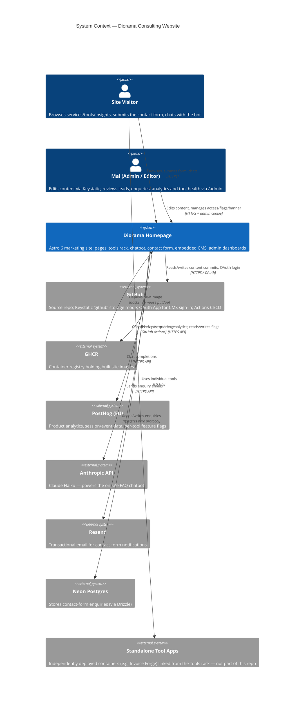
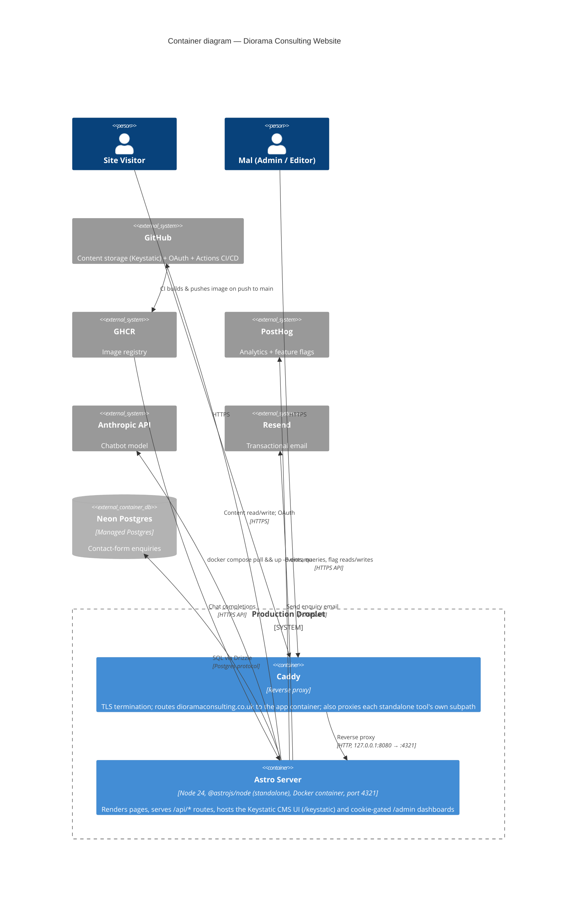
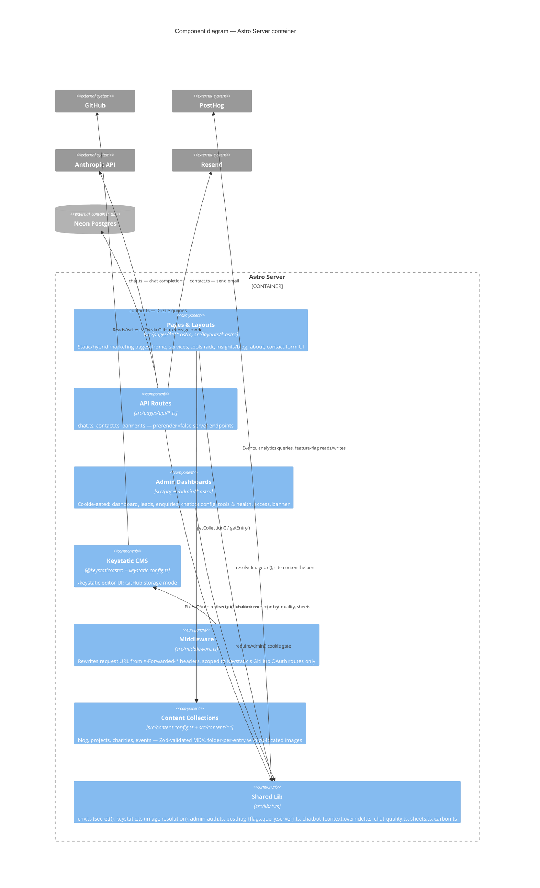
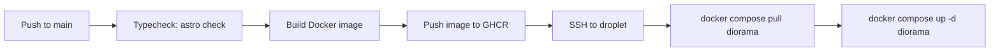

# ARCHITECTURE.md

Architecture of the Diorama Consulting website, described using the
[C4 model](https://c4model.com/): Context → Container → Component. Diagrams
are Mermaid's C4 syntax — render natively on GitHub, or paste into
[mermaid.live](https://mermaid.live) if your viewer doesn't support them.

---

## Level 1 — System Context

Who uses the site, and which external systems it depends on.

**Notes**
- There is exactly one "system" in scope for this repo — the Astro app. Every other box is an external dependency it talks to over HTTPS.
- The standalone Tool Apps are shown because the `/tools` rack links to them, but they have their own deploys/repos and are out of scope here.

---

## Level 2 — Containers

What actually runs, and where. Production is a single small droplet running Docker behind Caddy.

**Notes**
- The app is one container, one process — there's no separate CMS server; Keystatic runs embedded inside the same Astro server via `@keystatic/astro`.
- `PUBLIC_*` env vars (PostHog token/host, site domain) are baked in at **image build time**; everything else (`ANTHROPIC_API_KEY`, `RESEND_API_KEY`, `DATABASE_URL`, `CONTACT_ADMIN_TOKEN`) is read at **container runtime** from the droplet's env file — see `src/lib/env.ts`. Mixing these up has broken production before (build-time placeholders getting shipped instead of real secrets).
- The droplet never compiles anything; CI builds the image on the GitHub Actions runner and the droplet just pulls + restarts.

---

## Level 3 — Components (inside the Astro Server container)

**Notes**
- `content.config.ts` and `keystatic.config.ts` describe the *same* content independently (no shared codegen) — see `CLAUDE.md` for the sync gotcha.
- The two-field image pattern (`<name>` local upload / `<name>Url` external) and its resolvers in `lib/keystatic.ts` are what most page components go through to render an image, rather than reading collection fields directly.

---

## CI/CD flow (supplementary)

Not a C4 level, but the deploy path is architecturally significant enough to spell out:

See `.github/workflows/ci-cd.yml` and `CLAUDE.md` for details.
