### Reflections on Artificial Intelligence from the Royal Society

The Royal Society of London hosted a symposium yesterday organised by the University of Southampton to celebrate the 75th anniversary of the publication of Alan Turing's famous [Computing Machinery and Intelligence (aka "Imitation Game") paper](https://courses.cs.umbc.edu/471/papers/turing.pdf). I attended the event in person drawn by the auspicious surroundings and circumstances. The Royal Society is the world's oldest scientific establishment in continuous existence. It was granted its charter in 1660 by King Charles II to promote experimental learning and investigation of the physical world. It houses a collection of Turing's papers. A copy of his 1951 lecture [Intelligent Machinery, A Heretical Theory](https://gwern.net/doc/ai/1951-turing.pdf) was on display to browse. Here is the first page which still feels relevant decades later:

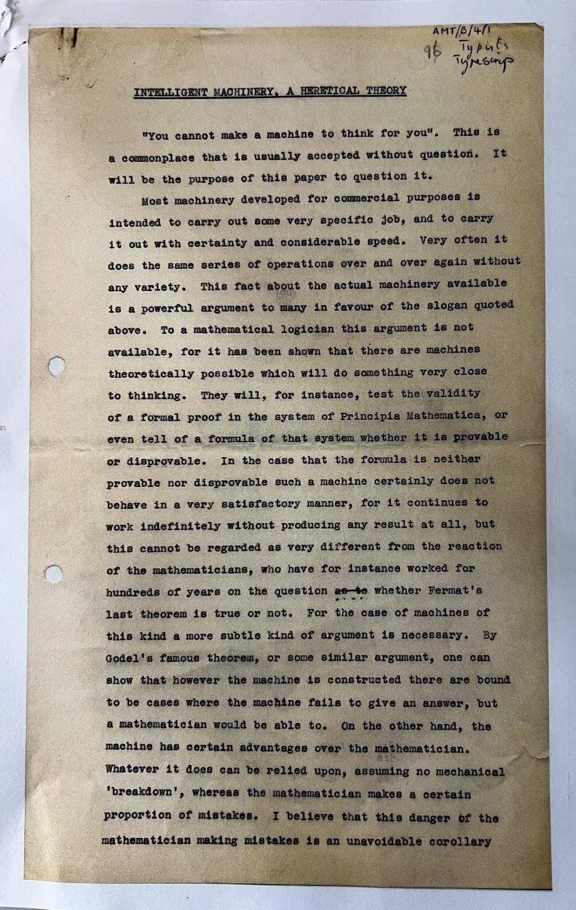

The event brought together an impressive gathering of AI academics, pioneers, and researchers to reflect on what the [Turing Test](https://en.wikipedia.org/wiki/Turing_test), whether it remains relevant today, and what it might mean for the future of artificial intelligence in a world replete with it. The topic of artificial general intelligence (AGI) loomed large over proceedings.

The speakers and panellists on the day were drawn largely from the world of academia. There were noticeably fewer industry voices unlike typical tech-oriented AI meetups. That created both a strength and a weakness. It allowed for skeptical and critical perspectives from a diverse set of speakers unburdened by commercial concerns and AI tech boosterism. However, commercial perspectives on scaling, deployment, user research and design that those involved in industry could bring were missing. Nevertheless, the day offered a refreshing counterweight to the prevailing gush around AI and the unique combination of setting, speakers and subjects made it feel like a very special one-off. The kind of symposium that people will talk about in years to come as a landmark event. Many other attendees I spoke to had the same feeling.

### Keynote: Reminding and Reasking About Humans and Thought

Legendary computer scientist [Dr Alan Kay](https://en.wikipedia.org/wiki/Alan_Kay), Xerox PARC veteran and creator of both object-oriented programming and Smalltalk opened with the first keynote. He started with the revelation that Turing didn't like the theatre because it was illusory. To Kay, this was deeply ironic because the very reason so many people enjoy the theatre is precisely because we love being fooled. Our normal state is delusional. We make up and generate the outside world inside our head. This leads to contradictions. We can experience a play in the theatre or on television and many of us will be fooled into believing it is real even though we know it is not. We have known this applies equally to AI since the mid 60s when the first chatbot Eliza surprised its creator:

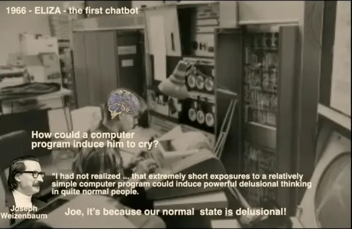

The difference between Eliza and modern AI is the staggering industrial scale of the exposure. The primary concern for Kay is safety in the face of evidence from notably the [Milgram Experiment](https://en.wikipedia.org/wiki/Milgram_experiment) of human propensity to obey whatever authority figures tell them.

Fortunately we humans can invent ways to act that are much smarter than we are. In fact, we have already made an artificial special intelligence, namely Science! Our default approach to all invention should involve a hypothesis then the collection of evidence through experiment to verify it. We need a form of Hippocratic Oath for engineers working on the frontier science. He invoked _[Nullius in Verba](https://en.wikipedia.org/wiki/Nullius_in_verba)_, the motto of the Royal Society which means "don't take anyone's word for it".

The current chatbot landscape is a chaotic mess. Large numbers of ordinary people are being fooled by illusions presented by technology which is fundamentally not intelligent. There is significant scope for catastrophe when this artificial non-intelligence meets the many human weaknesses we know exist. It is the power, scaling, reach, access and blindness of humans not the AI that we should worry about. Kay finished with a reminder that more is better until it isn't with a sketch of how coding has changed over his career. It elicited laughter from the audience but it's no laughing matter when the software goes inside of critical systems.

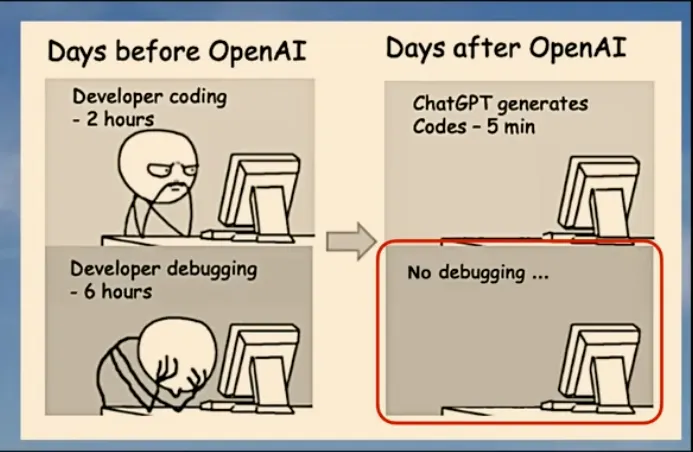

### Panel: What Did Turing Mean?

The first panel I attended revisited Turing's original framing:

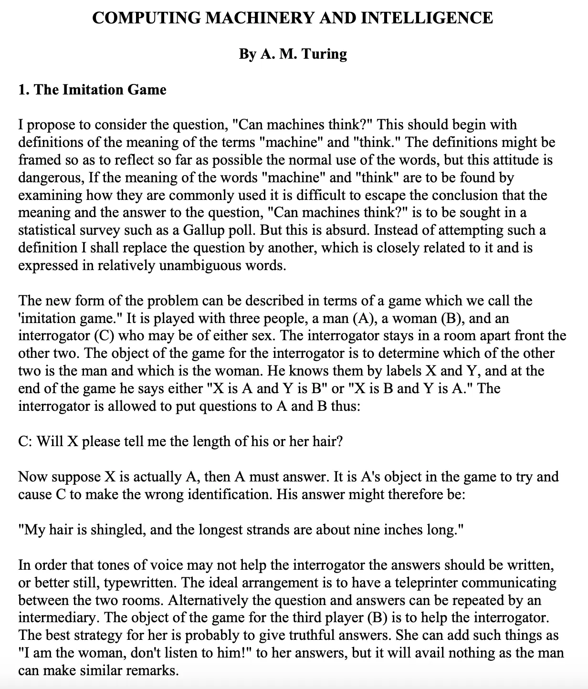

Was the Turing Test a proxy for intelligence, or merely a clever thought experiment about indistinguishability in conversation? Speakers on the panel included [Dr Alan Kay](https://en.wikipedia.org/wiki/Alan_Kay) and [Professor Sarah Dillon](https://www.english.cam.ac.uk/people/Sarah.Dillon/). They emphasised that Turing was pragmatic, not mystical. He didn't claim machines "think" like humans, rather, he shifted the question to whether their behaviour could be convincing enough to fool us with their imitation.

Fast forward 75 years, and the irony is that large language models (LLMs) are now accepted to routinely pass variants of the Turing Test daily. But the day's discussions revealed deep unease. Have we mistaken the astonishing verbal fluency of LLMs for understanding? Are we over-attributing intelligence to systems that, under the hood, are still brittle and opaque, with a gargantuan appetite for data?

### Keynote: The Grand AGI Delusion

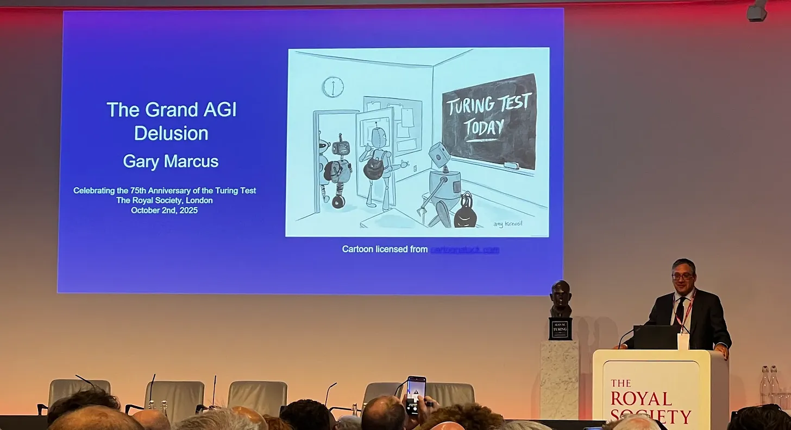

The harshest polemic of the day came from noted AI skeptic [Dr Gary Marcus](https://garymarcus.substack.com/) in his keynote _The Grand AGI Delusion_. His core message is one he is [well known for regularly espousing](https://garymarcus.substack.com/p/scaling-is-over-the-bubble-may-be), that scaling alone is not intelligence.

Marcus argued that LLMs prey on a familiar pattern in computing history, namely the belief that "more data and more compute" will eventually produce breakthroughs indistinguishable from general intelligence. Just as Moore's Law was an observation rather than a law, the "scaling hypothesis" is a contingent phenomenon that cannot solve reasoning, abstraction, or causal inference.

Quoting Rich Sutton's [Bitter Lesson](https://www.cs.utexas.edu/~eunsol/courses/data/bitter_lesson.pdf) paper which helped establish the case for scaling, Marcus noted that it was broadly true in driving progress over the last decade or so. However, scaling is now starting to hit its limits as all seemingly unbounded laws must. He pointed to Microsoft CEO Satya Nadella's recent acknowledgment that scaling was "running out of steam" and OpenAI's August 2025 problematic launch of GPT-5 as proof of the inherent challenges encountered building ever-larger models.

He emphasised that LLMs hallucinate and cannot escape certain error modes and underlined that modularity matters when it comes to modelling intelligence. Human cognition is not a monolithic system but a patchwork of specialised subsystems. Finally he accepted that narrow breakthroughs like [AlphaFold 3 in protein structure prediction](https://blog.google/technology/ai/google-deepmind-isomorphic-alphafold-3-ai-model/) are remarkable, but they do not add up to general intelligence.

Marcus is a strong advocate for a paradigm termed [neuro-symbolic AI](https://en.wikipedia.org/wiki/Neuro-symbolic_AI), a hybrid of neural networks and classical symbolic AI. Neuro-symbolic AI attempts to combine Daniel Kahnemann's bicameral model of thinking from [Thinking Fast, And Slow](https://en.wikipedia.org/wiki/Thinking,_Fast_and_Slow) of System 1 (fast, intuitive, generative) and System 2 (deliberative, logical, symbolic). He showed the slide below that mapped the different capabilities required directly onto Kahneman's two systems of thinking. While Generative AI is good at learning patterns, classical symbolic AI (or good old fashioned AI aka GOFAI) is still required for reasoning, grounding, and truth-preservation.

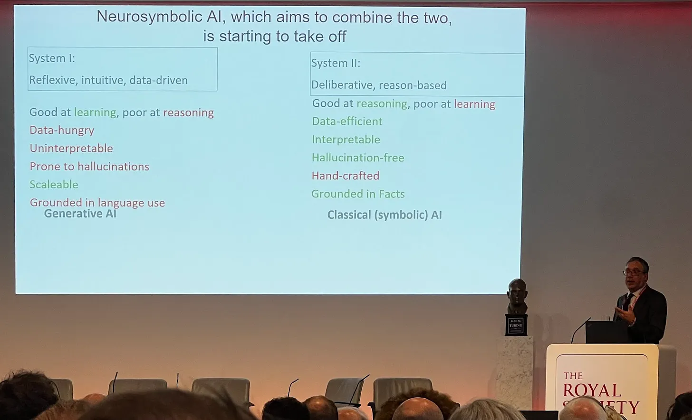

Neuro-symbolic AI has certainly [gained mindshare](https://trends.google.com/trends/explore?date=all&q=neurosymbolic%20AI&hl=en-GB) in the last year but remains elusive in terms of specific instantiation. In other words, how exactly would it work? One company worth watching in this space is [Unlikely AI](https://www.unlikely.ai/) whose founder [William Tunstall-Pedoe](https://williamtp.com/) was involved in creating Alexa.

### Panel: Is the Turing Test Still Relevant?

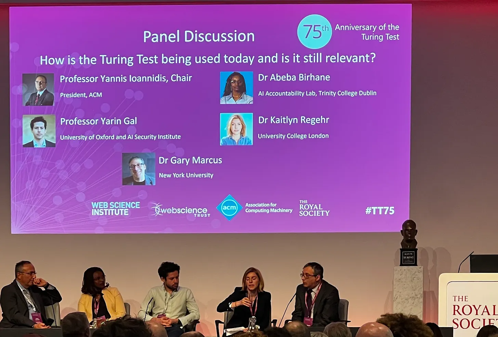

The second panel I attended was chaired by Professor Yannis Ioannidis. It included Marcus and three AI Safety experts, [Professor Yarin Gal](https://www.cs.ox.ac.uk/people/yarin.gal/website/) from Oxford, Dr Abeba Birhane of Trinity College and [Dr Kaitlyn Regehr](https://profiles.ucl.ac.uk/88177-kaitlyn-regehr) from UCL, a leading expert on the effect of digital technology on our brains and author of [Smartphone Nation](https://www.goodreads.com/book/show/220771215-smartphone-nation). They were asked whether the Turing Test still matters. There was broad consensus that we have probably already "passed" it at least in superficial, text-based terms Turing outlined. But does that mean the test itself is outdated, or that it has been misinterpreted?

Notable contributions came from Regehr who suggested that Gen X uses ChatGPT to augment existing knowledge, while Gen Z and Gen Alpha increasingly use AI as a replacement for learning itself. This raises the question: what is the appropriate level of cognition to outsource to AI tools? Regehr also introduced an intriguing social analogy. Just as society once created "physical education" (PE) to counterbalance sedentary lifestyles, perhaps we now need an emotional/critical literacy curriculum for the AI age to counteract the various health issues associated with using them. "PE for AI" if you like.

Birhane focussed on biases in models created through training on historical sources. Marcus suggested that LLMs not only perpetuate but also amplify historical biases through scaling. Bigger isn't better if the inputs themselves are flawed. Further that intelligence should not be defined as linguistic mimicry but as the capacity to solve new problems and generate new solutions.

There was also a lively discussion of the downsides of new technology. What is frequently heralded as transformative often has unforeseen side effects, resulting in a reversal of earlier promise. Regehr cautioned that technology often creates new addictions while failing to solve existing problems. Several of the panellists warned that failing to teach society to be skeptical risks collective gullibility, manipulation, and erosion of democratic resilience. It was openly acknowledged that ensuring broader AI literacy across the population was a difficult problem. There is no obvious simple answer given the pace of change. We are simply moving too fast.

### Keynote: Varieties of Intelligence

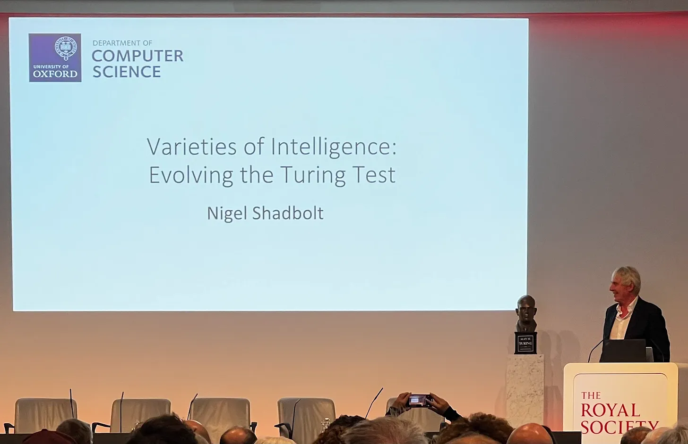

[Professor Sir Nigel Shadbolt](https://en.wikipedia.org/wiki/Nigel_Shadbolt) of Oxford University presented a keynote called _Varieties of Intelligence: Evolving the Turing Test_ in which he tried to reframe the debate. Intelligence, he argued, comes in many forms including biological, computational, symbolic. AI is best understood as a family of approaches covering deep learning, statistical learning, search, logic, knowledge representation, and knowledge-based systems. He is also an advocate of neuro-symbolic AI and provided a slide showing how neural network based approaches alone only address a few of the varieties of AI:

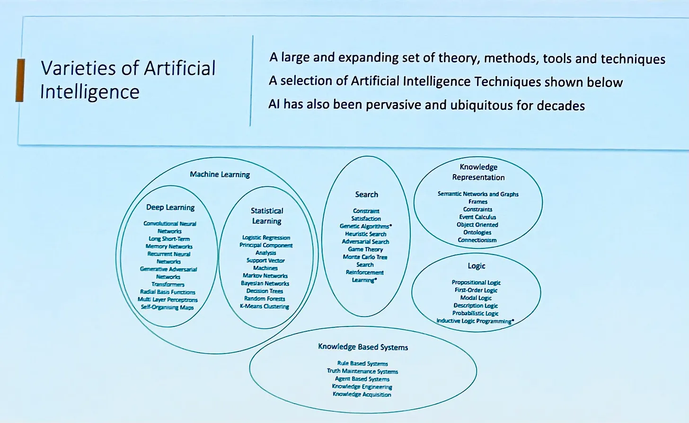

Shadbolt agreed with the previous speakers that scaling laws have limits. He highlighted the phenomenon of [model collapse](https://en.wikipedia.org/wiki/Model_collapse), where systems trained on their own outputs degrade. He also made a great point about language representation in models. The fundamental breakthrough that enabled modern natural language processing methods was the realisation that words could be represented as sparse vectors. The process of building them as embeddings in higher-dimensional spaces changed machine learning forever. However, they remain esoteric mathematical abstractions of language and world knowledge, not the thing itself.

The key question for Shadbolt was that if the Turing Test has been "passed," what comes next? Do we need new tests, calibrated not only for fluency but for robustness, truth, and reasoning?

### Panel: What is, or Will AGI Be?

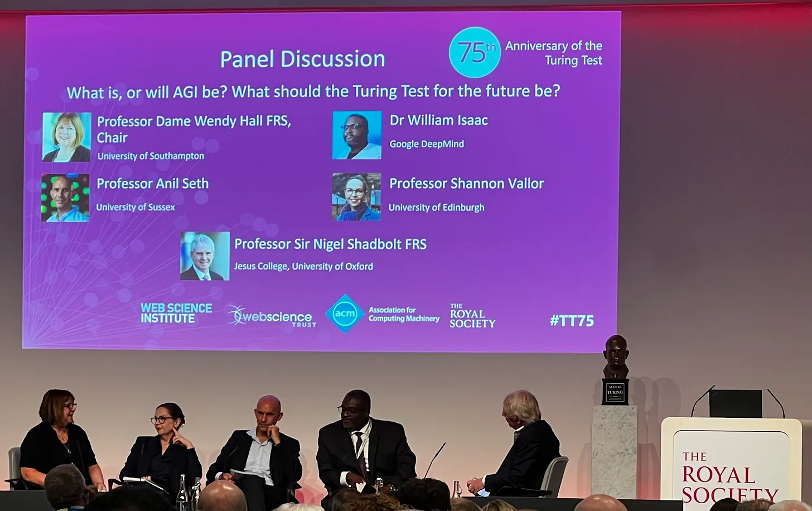

The final panel, chaired by [Professor Dame Wendy Hall](https://en.wikipedia.org/wiki/Wendy_Hall), included Shadbolt, cognitive scientist and author of [Being You](https://en.wikipedia.org/wiki/Being_You:_A_New_Science_of_Consciousness), Professor [Anil Seth](https://en.wikipedia.org/wiki/Anil_Seth), [Professor Shannon Vallor](https://efi.ed.ac.uk/people/shannon-vallor/) from the Edinburgh University who is the author of [The AI Mirror: How to Reclaim our Humanity](https://blogs.lse.ac.uk/lsereviewofbooks/2024/08/27/book-review-the-ai-mirror-shannon-vallor/), and Dr William Isaac from Deep Mind. The panel explored the thorny question of AGI itself. While their definitions varied, the general view was that AGI per se was not a useful goal to aim because, as Shadbolt explained earlier, intelligence is so vast and amorphous an entity. Isaac cut a somewhat isolated figure as the sole corporate representative. The others saw AGI as a "convenient pass" for Big Tech, a vague aspiration used to justify vast R&D spend and control of narrative. It was described as a "slippery, pre-defined trajectory" that risks collapsing consciousness and intelligence into machine mimicry.

Discussion points veered into socio-political terrain:

- **Anthropomorphism**: we over-attribute capabilities to machines. A chatbot may seem conscious, but simulation is not equivalence. How can we ensure society at large understands the difference?
- **Hallucinations**: remain a fundamental contradiction. How can a system riddled with such confident falsehoods plausibly lead us to AGI?
- **Ethics**: deploying AI at scale without guardrails risks harm to individuals and societies.
- **Consent**: AI development is already a "massive uncontrolled experiment" in which society is the subject. What about informed consent? Where is the political response to this in the form of controls and regulation?

A striking point of conversation related to our response to machines. Are we increasingly outsourcing decision-making to machines, becoming passive consumers of machine outputs? Or can we reassert agency through education, governance, critical thinking and AI literacy?

### Money, Power, and the AI Bubble

The strongest comments of the day were reserved for the role of Big Tech and money in driving the current AI trajectory. Tech CEOs were portrayed by Marcus as "convinced they are gods", shaping society through scarcity (for example, GPUs) and fear of missing out ("cure cancer in two years"). He has written widely that the real motivation is to gain political power and make a lot of money. While tech CEOs like Sam Altman (who he famously [has it in for](https://garymarcus.substack.com/p/things-are-so-desperate-at-openai)) talk about lofty social goals, the reality is far more grubby as evidenced by OpenAI's announcement this week of [Sora](https://the-decoder.com/openai-unveils-sora-2-video-model-with-realistic-physics-high-quality-audio-and-a-new-social-app/), their AI video slop competitor for TikTok:

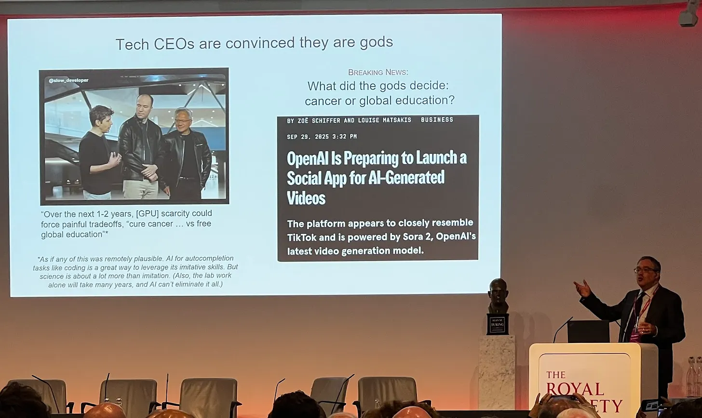

Governments, meanwhile, were accused of giving AI companies a free hand, ignoring environmental costs, bias, misinformation, and mental health impacts. Several speakers cited examples of AI-induced psychosis, suicides, and disinformation and warned of severe downstream risks if hype continues unchecked. There was a general sense from the academic that AI is in a bubble fuelled by rhetoric, marketing, and investor capital. When promises fail to materialise, a correction is inevitable, but by then the damage may already be done. As Vallor neatly put it:

> AGI is always in the future, which allows you to ignore its current harms.

The concerns raised by the panel echoed the analysis in [this recent excellent Plain English episode](https://podcasts.apple.com/gb/podcast/this-is-how-the-ai-bubble-could-burst/id1594471023?i=1000728026459). In it, investor and analyst Paul Kedrosky explains how the current wave of AI investment resembles prior tech hype cycles (railways, dot-com) with the same pattern of heavy upfront spending, uncertain monetisation, and over-optimistic growth assumptions. Investors are pouring capital into AI infrastructure (mainly GPUs and data centres build out), yet revenues from AI applications are vastly smaller and unevenly distributed. As with prior bubbles, the situation is fundamentally unsustainable. Indeed if anything, the situation with AI infrastructure is even more inherently unstable than that faced by railway lines or fiberoptic cable. GPUs have a limited shelf life and will need to be replaced within 2-3 years of being installed unlike the other two.

### The Call for Regulation

Across all the speakers, the need for regulation and education emerged as a consistent theme. The Royal Society were urged to take a stand as an august institution. Suggestions included:

- An AI "[Green Cross Code](https://en.wikipedia.org/wiki/Green_Cross_Code)" equivalent to road safety rules.
- Stronger calibration tests ([MMLU](https://www.datacamp.com/blog/what-is-mmlu) etc) that genuinely evaluate systems.
- Transparency requirements for training data and model behaviour.
- Critical AI literacy programmes for citizens, not just technologists.

There was real concern that the political will doesn't exist today. Governments were described by several speakers as uninterested in engaging with AI academics, leaving Big Tech driving the bus. Without a shift, we risk learning only after irreversible setbacks for society as has happened with social media. One of Marcus's slides made clear the profound ramifications for us all:

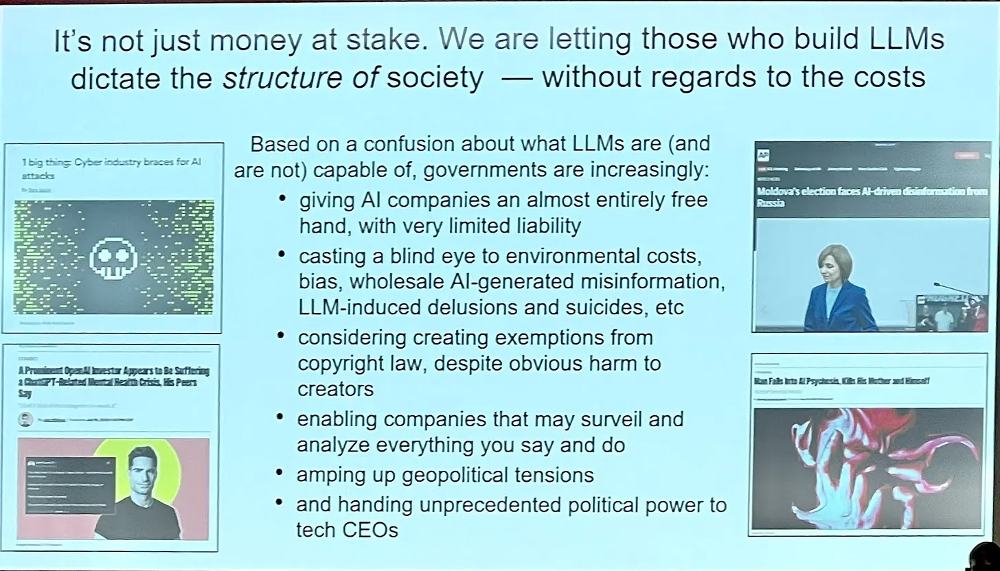

### Reflections

The Royal Society event reflected on the legacy and meaning of Turing's work on machine intelligence in our era of rapid AI progress. Most speakers demonstrated a critical and skeptical stance combined with academic caution of AI. That feels precisely what we need right now. Outside, the environment is overwhelmingly dominated by AI hype and billion-dollar valuations, the [Silicon Valley Consensus](https://www.forbes.com/sites/arafatkabir/2025/07/23/what-in-gods-name-is-the-san-francisco-consensus/). The event was a timely and necessary reminder of the limits of magical thinking around scaling, the illusions of AGI, and the societal risks of unregulated deployment.

75 years on from Turing's provocative paper, the most pressing question is no longer whether machines can imitate us, but whether we can govern the machines we've built. The Turing Test, in the narrow sense that he meant it, has been passed. The harder test now is one of human responsibility, restraint, and foresight. This is challenging given that the developers creating these systems do not fully understand how their models work. As Professor Vallor [put it](https://www.ft.com/content/34748e3e-92d1-4b42-9528-f98cf6b9f2f2):

> We should stop asking: is the machine intelligent? And ask: what exactly does the machine do?

The last speaker was [Sir Dermot Turing](https://en.wikipedia.org/wiki/Dermot_Turing), a living bridge to the past as Turing's nephew. He revealed that his uncle's favourite book was Samuel Butler's [Erewhon](https://en.wikipedia.org/wiki/Erewhon) published in 1872 which contains a section called [The Book of The Machines](https://www.marxists.org/reference/archive/butler-samuel/1872/erewhon/index.htm), the first reference in English Literature to the dangers of machine evolution. He finished by providing a favourite Turing quote:

> It seems probable that once the machine thinking method had started, it would not take long to outstrip our feeble powers. At some stage therefore, we should have to expect the machines to take control.

**UPDATE**: A week after writing this post, Gary Marcus posted [his own write-up of the event](https://garymarcus.substack.com/p/the-grand-agi-delusion) with a link to a full video of all the talks!

<Iframe
  src="https://www.youtube-nocookie.com/embed/GmnBTCKocZI?start=5977s&rel=0&autoplay=0&showinfo=0&enablejsapi=0"
  width="728"
  height="409"
  title="Royal Society: 75 Years of the Turing Test — full talks"
/>

