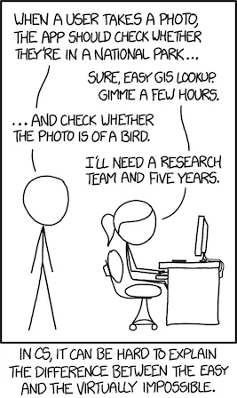
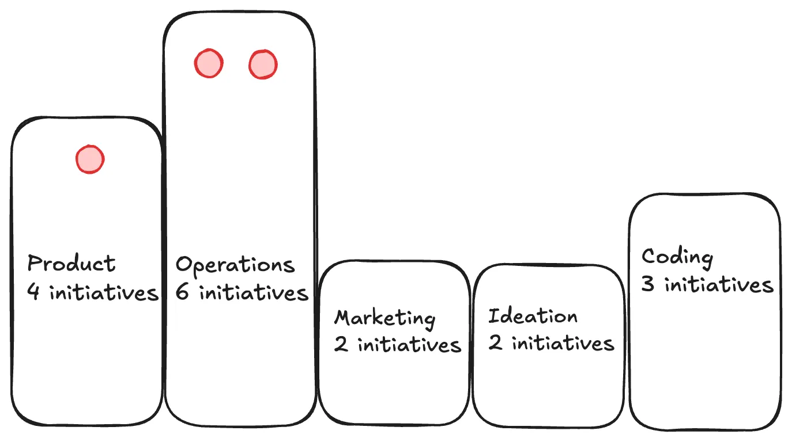
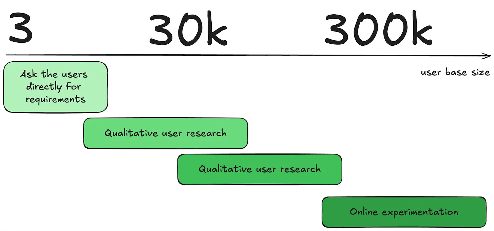

At the [SaaS CTO Unconference](https://scalefactory.com/events/saas-cto-network/conference/2024/) in London earlier this month, I participated in a panel on the role of AI in SaaS software. The conference was aimed at senior technology and product leaders and this post is a write up of my thoughts and responses broadly pitched at that cohort. My focus was mostly on the longer-term of AI than the current frenzy of interest.

The panel session started with the observation that we are increasingly surrounded by new technology. What criteria can we use to differentiate between that which is genuinely transformative and merely overhyped trends? We first need to define what we mean by “transformative technology”. In my view, transformative technology profoundly changes the nature of society and culture to qualify. It’s not possible to know this during the early stages of its development as you are _in medias res_ in a story with an unknown destination. To determine if a technology succeeded in making a dent in history whether positive or negative requires a distance measured in years. Technologies typically evolve in unpredictable ways. Their introduction creates second and third order effects resulting in unintended consequences. 

Two examples from my time at Symbian around the turn of the century help illustrate the argument. First up [WAP, or Wireless Application Protocol](https://en.wikipedia.org/wiki/Wireless_Application_Protocol). WAP was an ambitious complete messaging protocol conceived by the leaders of the nascent mobile industry including handset manufacturers Nokia, Motorola and Ericsson. It was pushed very hard by its advocates but failed to take off and was obsolete a decade later. A quick show of hands revealed several attendees were familiar with this long dead end. Typing WAP into Google returns a lewd Cardi B track as top hit. The second example was the camera phone. The Nokia 7650 or Calypso shipped around the same time in 2002 as the first mass market phone with integrated camera. The 7650 was launched with relatively little hype certainly relative to WAP yet it proved to be a paradigm shift for communication based on images and video. At the time Nokia along with many others were convinced the future of mobile lay in services and that integrated capabilities such as cameras would help realise that future. Many of the engineers working on the product, however, were less sure of the specific instantiation. Why would anyone want a phone with a camera in it when you had perfectly adequate complementary devices on the market? Nobody predicted that within a generation there would be more camera phones than people on earth. Bundling complementary technologies to create new communication possibilities proved to be a huge hit with consumers. Are there any lessons we can draw from this and many other examples of revolutionary technology? Here are four criteria that I outlined during the panel session: 

1. **Does it provide genuine user value?** Does the technology you are adding offer genuine utility to consumers? One way to determine this is to ask your early adopters. You can employ the [Sean Ellis 40% rule](https://medium.com/radikal-studio/pmf-framework-5-steps-to-product-market-fit-2021-4c95a0c964ad) as part of early User Research during a discovery phase to understand how many would be disappointed to see the capability removed. Generative AI as a technology has a lot more obvious and accessible utility to ordinary people than NFTs which although hyped, never really took off with mass consumers. It’s illustrative to read this recent post by Hanif Kureishi written after [experiencing generative AI for the first time](https://hanifkureishi.substack.com/p/ai-and-i?triedRedirect=true). Kureishi used Perplexity to write a letter in his own style and found to his surprise that he didn’t need to change it at all once the prompt was adjusted to draw the right response. He saw it for what it was, a tool to help him accomplish certain tasks quicker.

2. **Is it easy to integrate and trial?** Does the technology offer a low barrier to entry? Generative AI is again compelling in this respect because all you have to do is call an API to integrate it. WAP on the other hand required you and others to build and integrate a whole tech stack first before communication was possible.

3. **Does it exhibit multi-use case platform effects?** Once integrated, does the technology offer support for different use cases? WAP for instance was limited to communication on mobile devices. A similar mobile communications protocol developed around the same time was Bluetooth. This proved far more versatile because it could support many different use cases from wireless headsets and speakers to file transfer and device connectivity. Generative AI has a strong advantage here because you can use it via an API integration to support a whole host of use cases across many different domains such as Product, Operations, Marketing, Ideation and Software Development. 

4. **Does it involve open standards?** Does the technology naturally support open integration and interoperability? The history of technology has provided many examples such as wireless communications and the Internet as to why protocols and open standards matter and create momentum through network effects. However, standards take a long time to emerge and become solidified. The hard work of specifying and building them is often seen as uninteresting commercially and not particularly cool. This is an area where Generative AI faces some challenges. The multi-agentic future we are moving towards does not yet have any protocols or standards. If we imagine a world where our personal agents are communicating with each other, what would they say and how would it be structured and represented to ensure maximal clarity? Chatbots merely replicate the issues around misunderstanding that arise with human communication.

One of the reasons it is so hard to foresee what will win out is that transformative technology emits a weak signal at first. Over a decade ago during a summer in which the London Olympics dominated the news cycle, I was researching a digital concierge proposition. The options at that time were very limited but I did stumble across Evi, a question and answer bot that had been built by True Knowledge in Cambridge. It was possible to access Evi via an API. I recall doing so and being astonished at being able to retrieve a convincing response to the question “why is the sky blue?”. The shape of a future in which artificial intelligence was available via REST seemed clearly discernible. Access to it has remained the same mediated through an API. The results however have become so much more unreasonably effective in the intervening years.

```python
def getAnswer(question, username, password, proxy={}):
 url = "https://api.trueknowledge.com/direct_answer?object_metadata=image128,wikipedia,official&%s"
 # Encode params including question and invoke urllib2 urlopen
 params = {
 'question': question,
 'api_account_id': username,
 'api_password': password,
 }
 pr = urllib2.ProxyHandler(proxy)
 urllib2.install_opener(urllib2.build_opener(pr))
 req = url % (urllib.urlencode(params))
 xml = urllib2.urlopen(req).read()
 # xml.etree.ElementTree to parse and dictify response
 r = {}
 doc = lxml.fromstring(xml)
 resp = doc.getchildren()
 for e in resp:
 attr = e.tag[41:]
 r[attr] = e.text
 return r
```

So much so that the famed xkcd from that era [is itself now obsolete](https://arstechnica.com/information-technology/2024/01/famous-xkcd-comic-comes-full-circle-with-ai-bird-identifying-binoculars/#:~:text=In%202014%2C%20a%20famous%20xkcd,a%20research%20team%20and%20five):



There’s an important point to be made here on the nature of innovation. There are broadly two types that apply in the case of a typical technology business within the classic Innovation Matrix shown below namely Disruptive and Sustaining innovation in the right hand column.


Transformative technology typically gets associated with disruptive innovation at least in the public mind. The 0->1 _ex nihilo_ creation of something distinctly new in a well-defined domain that didn’t exist in the world before. Inspired by the creative genius of an extraordinary individual. Examples abound from William Blake in the early Enlightenment with relief etching to 21st Century Steve Jobs with the iPhone. This kind of innovation doesn’t really emerge from the void fully formed though. It requires a lot of planning and preparation and builds upon lots of existing technologies and knowledge. Whether an invention is transformative or just an application of prior art is a matter of interpretation. 

Sustaining innovation, however radical, is essentially standard engineering building on top of technologies embedded in existing platforms. We can call it 1->1.1 to distinguish it from 0->1. For all the hype, many people working in technology companies today are operating in the realm of sustaining innovation leveraging adjacent technology to advance current state architecture. Brian W. Arthur’s book [The Nature of Technology](https://www.amazon.co.uk/Nature-Technology-What-How-Evolves/dp/0141031638) covers this territory well. In it he explains how technology advances through "combinatorial evolution” illustrated with the example of Frank Whittle's jet engine. The principles and goals of the modern jet engine remain the same as in Whittle’s original prototype. The instantiation, however, is very different with vastly more parts incorporating multiple advances which are encapsulated in submodules. The transformation of society through technology typically involves a combination of Disruptive and then Sustaining innovation. 

What tools can you use to manage a roster of potential technologies you can integrate to drive sustaining innovation? A Technology Radar is a useful tool. It allows you to classify new technology in two dimensions. Firstly in terms of domain of application such as Platform, Language, Tool or Technique. Then in terms of maturity which determines what action to take in increasing order of confidence Hold, Assess, Trial, Adopt. Maturity assignment is typically based on research and investigation of the corresponding domain of application. Any technologies falling into Assess, Trial as well as Adopt status could all be targeted for a dedicated hands-on PoC or spike before becoming an approved option. 

Given these challenges, how can one communicate the value and risks of adopting new technologies to non-technical stakeholders in your organisation? You first need a way of articulating the trade-offs between the risk of adoption and the opportunity cost of missing out on innovation. This is challenging because they are typically not easy to compare like for like. There is an instinctive tendency to over-privilege business risk over innovation in a lot of companies as they scale. This leads to the famous innovator’s dilemma where a company is out-manoeuvred by smaller more agile competition. You can be entirely familiar with the territory, absorb all the learning from the past and still make the same mistake as many other illustrious companies such as Xerox and Kodak. Nokia fell into the same trap in the 2010s undone by iPhone and Android. Microsoft managed to change their game under Satya Nadella. Intel, however, doubled down on their profitable Intel model leading them to miss out on both mobile and AI and facing an uncertain future. There seems to be an ineluctable law in operation here. Being eclipsed by new competitors feels like an inevitable fate for almost every large company as [Managerialism](https://www.palladiummag.com/2024/08/30/when-the-mismanagerial-class-destroys-great-companies/) prevails and stifles new thinking especially at middle levels. It’s important that we have wider awareness and business literacy around the risks of not innovating or nurturing innovation properly. This is a particular issue in the UK. Tom Brown in his excellent book [Tragedy and Challenge](https://www.amazon.co.uk/Tragedy-Challenge-Engineerings-Decline-Economy/dp/1788035313) lays out this sorry territory well. Sharon White, the outgoing boss of UK retailer John Lewis, [was interviewed in the FT recently](https://www.ft.com/content/4ad50d1a-a913-44da-a4aa-dbbe43c1a7b0?emailId=812780c6-114e-4c34-9c9f-5c925264bc04&segmentId=2e4343f6-b08f-9184-785d-0a53b99d57bf) and made a great point regarding the current frenzy around AI and how many UK mid market companies are still struggling with more prosaic concerns:

> I raise the long-term stagnation of productivity in the UK. White remarks that “the interesting thing with the UK, particularly given that so much of the debate over the last two or three years has been about artificial intelligence, is that many private sector British companies haven’t even digitised.

The situation is, if anything, [even worse in government](https://www.ft.com/content/eac1f3e2-8e89-49df-826c-ed458a29b4c2):

> The lack of digital transformation is routinely cited as one of the reasons for low NHS productivity. Ministers talk in heroic terms about the promise of artificial intelligence and yet even a unified database is beyond some public services.

Innovation doesn’t mean blind adoption of the latest technology trend. In many cases, it is simply standard engineering, steady integration of sustaining innovation building on current capabilities. A value stream mapping (VSM) exercise can be useful to run. This allows you to gather information on where the pain points are across an organisation and then make an assessment of what impact it would generate to fix. It’s also important to hold the thought that it doesn’t need to be expensive to do so. You are probably not building an iPhone. Operate within constraints and practise frugal innovation (_jugaad_). Leverage existing platforms for this to move as fast as possible and avoid rolling your own at least at first and encourage controlled experimentation. [McKinsey’s Three Horizons model](https://www.mckinsey.com/capabilities/strategy-and-corporate-finance/our-insights/enduring-ideas-the-three-horizons-of-growth) is a good for framing resource allocation. It balances investment portfolios in a 70-20-10 across three impact horizons roughly six months, one year, two years. For the 20-10 focussed on the future, you have a lot more agency than you might think. There are tools you can use to try to span the distance. The [PRFAQ and associated Working Backwards mechanism](https://productstrategy.co/working-backwards-the-amazon-prfaq-for-product-innovation/) is used at Amazon for exploring the future. Studying the past is also valuable. It is littered with hauntology, futures that never arrived as well as few visions that did become largely realised as hyperstition, fictions that became real, 

We were asked what advice we would give to a tech leader who is feeling pressure to implement AI features but isn't sure where to start. A good rule of thumb in these situations is to force yourself to default to yes. Feel the fear and do it anyway but using a structured approach. Start by talking to stakeholders in different parts of the business to get a wider perspective of where AI features might be useful. Reach out across the C team. As a C-team member, that is your first team. Requirements across this cohort will be very context-dependent depending on the nature of the business and your role within it. 

POMIC is the name of a framework I’ve used to help frame different types of AI initiatives according to their domain of application. POMIC is an acronym for: Product, Operations, Marketing, Ideation, Coding. These represent five domains where AI use cases most frequently surface. Canvassing your organisation leveraging your C-team relationships should help you assess opportunities on behalf of your business. After speaking to all stakeholders, you have an initial list of potential initiatives across the POMIC spectrum. At this point you can start to rank them using a standard approach. A common industry framework often used in marketplace businesses is [RICE](https://www.productplan.com/glossary/rice-scoring-model/) - reach, impact, confidence, effort. Calculating the RICE score of each POMIC initiative is a quantified way of determining business value. Once you have ranked your initiatives you should look to run a program to build a proof of concept for the top 1-3. Every company will have a different POMIC shape depending on unique context. The diagram below shows the POMIC shape for a company that has a heavy operations burden and some aspirations to integrate. The top three initiatives to trial here lie in Operations and Product. 



Coding represents something of a special case in the POMIC framework because initiatives here can and should be actively encouraged and pushed from within the Engineering team in every business. There is a growing consensus that engineers who do not embrace generative AI tools in their day to day work will be left behind. The specifics change a lot almost month by month. The latest hotness is Anthropic’s Claude Sonnet LLM and the Cursor IDE as outlined in [this excellent Refactoring post](https://refactoring.fm/p/predictions-about-ai) by Luca Rossi which also introduces a crucial new paradigm for software engineering called AI-driven development (AIDD). AIDD is distinct from AI-assisted development in which copilot tools, ChatGPT and Perplexity are all used to aid the software developer. These changes seem to auger a very profound transformation in the process of software development in a way that Rossi does a great job of explaining.

A couple of recommendations. Firstly, if you’re running an experiment to test a particular user journey that incorporates ML or AI, ensure that your control is a baseline or naive implementation which doesn’t use any ML or AI. Your initial goal with your hypothesis variant is to do better than that. Secondly don’t overthink or over analyse risks. Many decisions are reversible or two-way doors. This is even more so the case for internal use cases which is where you should focus initial effort to get buy-in and avoid the complications that come with experimenting on your customers rather than your staff. There are issues around QA testing AI propositions and the lack of determinism in the answers they emit. You should structure your trial to be reversible such that if the AI feature isn’t working, you can roll back. It’s important that the barrier for trial and rollback is low. That should help counter concerns around risks and cost.

One specific issue with product experimentation in the context of SaaS businesses involves cohort size. One can look at cohort sizes through the lens of something I term the 3-30-300 rule. Consider a product built for 3 users. For such a product, you would manage requirements gathering and sustaining innovation entirely differently for one built for 30k users. There you would need to build qualitative and quantitative tools and processing for gathering user feedback and aggregated requirements without asking each user. An example of such a tool would be user surveys. At the end of the spectrum with 300k+ users you enter the domain of product experimentation where you are able to run a lot of statistically significant tests in parallel with large user cohorts. The diagram below attempts to illustrate this variation in approach based on user base:



What potential disruption is on the horizon beyond AI that tech leaders should be preparing for? I expressed my view that the biggest elephant in the room is the climate crisis. Every company has a fire going on in the basement and will have to develop a point of view on how they will adapt their business to a rapidly changing climate. There are two categories of risk they face:

- **Transition Risks** in changes to strategies, policies, or investments as society and industry work to reduce reliance on carbon and impact on the climate.

- **Physical Risks** to infrastructure and supply chain from climate impact itself.

Compounding the issue, everyone knows Generative AI [is itself a resource hog](https://www.nature.com/articles/s42256-020-0219-9). New energy sources will need to be added to the US grid to support the envisaged growth of AI data centres. As technology leaders in our organisations and in many cases C-team members, we have a responsibility to effectively communicate the reality of the climate crisis. We have to ensure our teams understand that while it is real and very serious we can help in addressing the challenge. We have an opportunity to bring some hope into the world. What can we do? We can adopt a legacy mindset. Put ourselves in the future and look back. What would you be doing now from that perspective?

The panel session finished with a provocation. If we had to declare AI either “blessing” or “bandwagon” which would we choose? I suggested this was somewhat of a false dichotomy. Like all technology, AI is merely a tool. The real question is what are you trying to achieve with it? What role do you see it playing in your organisation and what does it mean for those working in it? AI is mute on this. Like Tarkovsky’s mysterious ocean in Solaris, it merely reflects what you want to see. And if we consider its baleful impact across society, it can support the creation of utopia or dystopia. At one end of the spectrum lies the augmentation scenario where employees are made more productive by leveraging AI. This is a vision that Salesforce has for their flagship EinsteinGPT technology. At the other end of the spectrum is a replacement scenario where humans are removed from the loop and the spectre of technological unemployment is a growing concern. It’s possible to find recipes online for how to build an “insanely fast AI cold call agent with Grok”. Right now call centre agents on the front line are feeling the heat. Eventually it will be applied to lots of other roles too including at C level.

Whether it is a blessing or not depends on your perspective. Many others [including Vinod Khosla](https://www.khoslaventures.com/ai-dystopia-or-utopia/) have come to the same conclusion:

> The future that happens will be the future to which we as society decide to guide this powerful tool. That will be a series of policy choices and not technology choices, and will vary by country. Some will take advantage of it and some will not. What should be individual person level vs societal choice? 
>
> …
>
> AI is a powerful tool which , like any previous powerful technology tool like nuclear or biotechnology, can be used for good or bad. It is imperative that we choose carefully and use it to construct that “possible" world guided by societal, not technology’s, choices. That we not forsake the benefits out of fear of the unknown.

What is your view on the end state for humanity? How does AI help achieve that? Is it a vision that you’d be proud of working towards? Adopting a legacy mindset and looking back upon the envisioned outcome after projecting yourself to a place in our far future can help you to consider the answer to this question.
