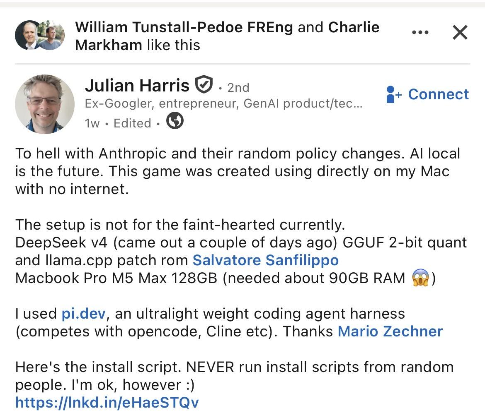
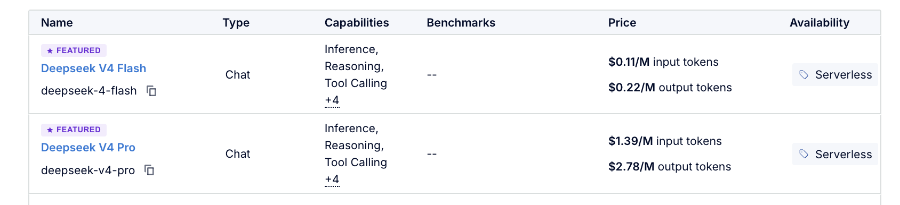
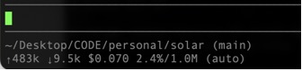
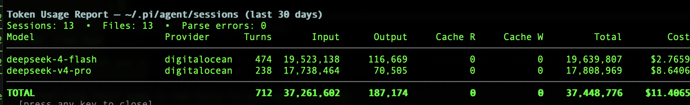
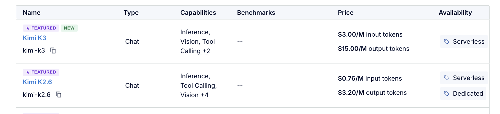
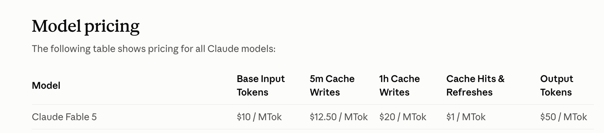
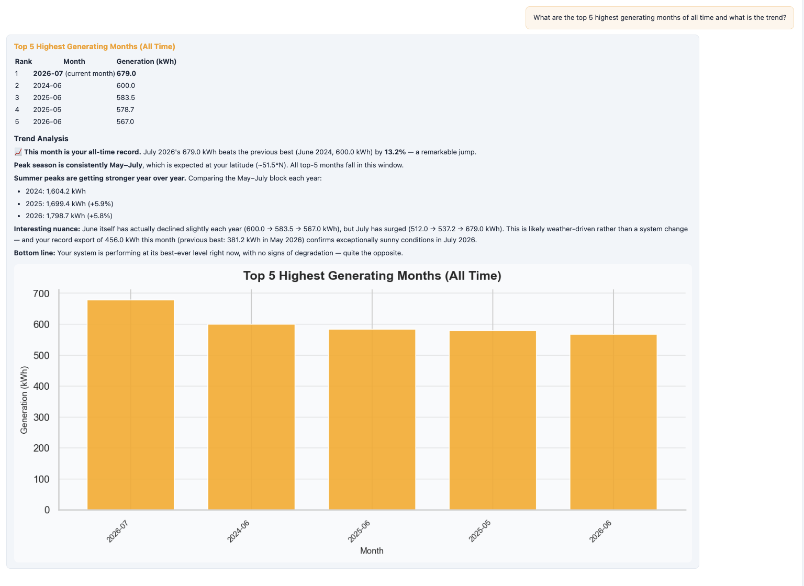

**Migrating from Claude Code to pi.dev and DigitalOcean Serverless Inference**

During the last year, in keeping with many other developers, I have been experimenting extensively with AI coding tools. Over this period there have been significant advances in underlying capability from leading model providers such as Anthropic and OpenAI. Developers have broadly had to embrace the changes willingly or not. It has not been easy or straightforward. Rising costs and unpredictable policy changes have contributed to a growing sense of frustration. It has become hard to reliably predict the cost of workflows built on top of Claude Code or Codex. In the meantime, the open-weight model ecosystem has matured enough to make alternative approaches credible. This post outlines one practical path using DigitalOcean's pay-as-you-go [Serverless Inference](https://docs.digitalocean.com/products/inference/how-to/use-serverless-inference/) as a backend for agentic coding. It will be of particular interest to those who have existing DigitalOcean accounts.

### **The Journey from IDE to ADE**

In 2025 I mainly used integrated development environments (IDEs) like Cursor and Kiro for AI coding. These environments built upon the paradigm provided by prior non-AI powered IDEs such as VSCode, Eclipse and IntelliJ that developers have been comfortable with for decades. In many senses, the IDE was the starting point for software development for a whole generation of coders.

As 2026 broke, along with many others, I switched from my IDEs to using Agentic Development Environments (ADEs) notably Anthropic's Claude Code and OpenAI Codex because I already had Pro accounts for both. An Agentic IDE can seem mysterious and alien to non-developers. Your interface is a blinking cursor on the command line in a terminal at which you enter text prompts in English expressing what you'd like the generated software to do. The underlying capability to convert those prompts into working code lives in an agentic harness built into the tool which sits above a model which you can swap through the UI. The quality of this model, its supporting coding harness and your skill in driving them with text prompts determine the quality of the outcomes.

For a while things went well, and I found myself gravitating towards Claude Code as my default coding environment paired with Anthropic's Opus models. By Q2 though, frustrations began to creep in through token pricing variation, arbitrary throttling and policy changes with little warning. Others in the developer community were also starting to vent their frustration with Anthropic around the same time and advocating for a move to open weight models. Developer [Julian Harris](https://www.linkedin.com/posts/julianharris_to-hell-with-anthropic-and-their-random-policy-ugcPost-7454642397797380096-SSWu) hit a personal chord with his LinkedIn post on the topic (see also [his notes on the switch](https://gist.github.com/boxabirds/13a54abc3314afca59b0bb87e9216b44)):



I wanted to reduce my dependency on Anthropic and get better visibility over costs without having to spend thousands on expensive hardware. That imperative is especially important in the charity and not-for-profit sector which I support with AI advisory work. Budget predictability is critical and governance obligations require avoidance of vendor lock-in. Many in the developer community were reporting that open-source coding harnesses combined with open-weight models offered a genuinely viable alternative.

This led me to try out [pi.dev](https://pi.dev) the open source ADE mentioned by Harris in his post. It has no proprietary features, no MCP complexity, and no vendor to align with, providing a basic no-frills agentic harness built around a terminal interface you can point at any OpenAI-compatible inference endpoint. This made it the natural starting point for a more sustainable setup as a coding harness. The question was what model provider to pair it with for inference as part of a full migration off Anthropic. There were three broad options:

1. **Local model:** In this scenario you run an open-weight model entirely on your own hardware with no cloud API, no per-token billing and complete data locality. Some open models such as DeepSeek v4 are available to pull and run locally with zero per-token billing using [Ollama](https://ollama.com) which allows you to run open-weight models entirely on your own hardware. However full-size DeepSeek v4 Pro/Flash struggle to work within laptop memory without heavy quantization that hurts coding quality. It can tie up your machine for the duration of a session and limit access when away from that one laptop. Agentic workloads typically want more headroom than a local setup comfortably gives.
2. [**OpenRouter**](https://openrouter.ai)**:** OpenRouter is a third-party API aggregator that sits in front of dozens of model providers and exposes them through a single OpenAI-compatible endpoint. Developer Chris Parsons made a compelling case for this route in his post "[Open Models Are Ready](https://www.chrismdp.com/open-models-are-ready/)", and it is the path many early pi.dev adopters take. If you're starting from scratch, it's probably the right default. You have one API key, many open models, no single-cloud commitment.
3. [**Serverless Inference**](https://www.digitalocean.com/resources/articles/serverless-inference)**:** DigitalOcean Serverless Inference is a managed API service that gives you access to open-weight models such as DeepSeek v4 through a pay-as-you-go, OpenAI-compatible endpoint, with no GPU infrastructure to manage yourself. I chose it as I was already a DigitalOcean customer of ten years standing. I've used them exclusively for cloud based hosting on personal side projects, so I have an existing account, billing relationship, earned trust and no new vendor to onboard. Using the same provider for both infrastructure and inference is easier to manage. They were also offering a promotion in May with a 75% token price cut which was a further inducement. Configuring pi.dev to work with their endpoint looked straightforward enough by modifying a single setup file.

### **Getting started with Serverless Inference**

I went with Option 3 and started by creating a DigitalOcean Model Access Key scoped to DeepSeek v4 Pro. The advertised cost at time of writing is shown below. Note the pricing for Pro relative to Flash which is an order of magnitude cheaper:



This curl POST to the Pro inference endpoint worked first time with the results shown inline:

```bash
curl -X POST 'https://inference.do-ai.run/v1/chat/completions' \
  -H 'Content-Type: application/json' \
  -H "Authorization: Bearer <MODEL_ACCESS_KEY>" \
  -d '{
    "model": "deepseek-v4-pro",
    "messages": [
      { "role": "user", "content": "Hello, world!" }
    ],
    "stream": false
  }'
```

```json
{
  "choices": [
    {
      "finish_reason": "stop",
      "index": 0,
      "logprobs": null,
      "message": {
        "content": "Hi there! It looks like you're starting with the classic \"Hello, world!\" — a great beginning in programming and technology.\n\nHow can I help you today? Whether you're learning to code, exploring ideas, working on a project, or just saying hello, I'm here for you. 🙂",
        "reasoning_content": null,
        "refusal": null,
        "role": "assistant"
      }
    }
  ],
  "created": 1779316296,
  "id": "",
  "model": "deepseek-v4-pro",
  "object": "chat.completion",
  "usage": {
    "cache_created_input_tokens": 0,
    "cache_creation": { "ephemeral_1h_input_tokens": 0, "ephemeral_5m_input_tokens": 0 },
    "cache_read_input_tokens": 0,
    "completion_tokens": 62,
    "prompt_tokens": 8,
    "speed": null,
    "total_tokens": 70
  }
}
```

### **Configuring pi.dev**

I moved onto configuring the pi.dev ADE to point to the DigitalOcean endpoint. This required creating a models.json file in my MacBook's \~/.pi/agent directory. The guidance supplied by Claude didn't work. After some trial and error and reading through [the DigitalOcean documentation](https://docs.digitalocean.com/products/inference/how-to/use-serverless-inference/), I discovered that I had to set the api field to openai-completions from the default. Here is the full configuration for models.json that worked for me in mapping pi.dev to an OpenAI-compatible Serverless Inference endpoint supporting both DeepSeek Pro and Flash:

```bash
mkdir -p ~/.pi/agent
cat << 'EOF' > ~/.pi/agent/models.json
{
  "providers": {
    "digitalocean": {
      "baseUrl": "https://inference.do-ai.run/v1",
      "api": "openai-completions",
      "apiKey": "MODEL_ACCESS_KEY",
      "models": [
        {
          "id": "deepseek-v4-pro",
          "name": "DeepSeek V4 Pro (DO)",
          "reasoning": false,
          "input": ["text"],
          "contextWindow": 1000000,
          "maxTokens": 32768,
          "cost": { "input": 1.74, "output": 3.48, "cacheRead": 0, "cacheWrite": 0 }
        },
        {
          "id": "deepseek-v4-flash",
          "name": "DeepSeek V4 Flash (DO)",
          "reasoning": false,
          "input": ["text"],
          "contextWindow": 1000000,
          "maxTokens": 32768,
          "cost": { "input": 0.14, "output": 0.28, "cacheRead": 0, "cacheWrite": 0 }
        }
      ]
    }
  }
}
EOF
```

### **Understanding the costs**

At this point I was able to launch pi.dev and hit the Serverless Inference endpoint. I set the cost fields in models.json to align with DigitalOcean's pricing for DeepSeek models. DeepSeek v4 Flash was missing from the model catalog when I began. I started out with DeepSeek v4 Pro and used it in combination with pi.dev for AI coding on a side project called Solar Dashboard I was working on. It's a solar panel generation visualisation tool that I've written about separately [here](https://dioramaconsulting.co.uk/insights/seeking-solis/). I consumed around 15 million input tokens in a week while working on an early version of the codebase, a number that gives a sense of the sheer volume of tokens involved in agentic coding. None of the AI coding harnesses report the corresponding environmental costs. It's hard to be precise on the equivalent cost of 1 million input tokens. Estimates in the literature span two orders of magnitude suggesting it could be anywhere from 1-70 litres of water and 0.5-25kg of CO2 depending on model size, context length, hardware and batching efficiency. If we take the midpoint of this range as our starting point, 15 million input tokens over a week would correspond to almost 500 litres of water and 187kg of CO2. The latter equates to about 1000km driving in a small car. It's a sobering thought and one that perhaps I should reflect upon more when using these tools.

The pi.dev console provides information on token counts and running cost live under the prompt box. The numbers can be a bit difficult to parse at first. Here is a snapshot with a breakdown of what each value in it corresponds to:



| Element   | Value                      | Meaning                                                                                                                                                                                |
| --------- | -------------------------- | -------------------------------------------------------------------------------------------------------------------------------------------------------------------------------------- |
| ↑483k     | Input tokens this session  | Passed into the LLM.                                                                                                                                                                   |
| ↓9.5k     | Output tokens this session | Generated by the LLM. The relatively high 50:1 ratio of input to output tokens is typical for an AI coding session                                                                     |
| $0.070    | Session cost               | Deep Seek V4 Flash was initially priced at $0.14/M input tokens and $0.28/M output tokens by Digital Ocean. This is a combined cost arrived at as 0.483 x 0.14 + 0.0095 x 0.28 = 0.070 |
| 2.4%/1.0M | Context usage              | Only 2.4% of the 1M context window used which indicates plenty of headroom available                                                                                                   |
| (auto)    | Compaction mode            | Automatic context compaction enabled                                                                                                                                                   |

### **Switching to the Flash model**

My bill at the end of May was higher than expected. The promotional pricing I had seen did not appear to have applied as the numbers tallied with full catalog rates. I raised a support ticket and flagged it to my account contact. The team responded quickly. It was a useful reminder that having an existing relationship with a vendor makes a real difference when you need support. Browsing the model catalog, I noticed that DigitalOcean had now [added DeepSeek v4 Flash](https://www.digitalocean.com/blog/whats-new-on-inference-engine). I updated my config accordingly and generated then verified as working a new key covering both Pro and Flash.

### **What my usage data reveals**

AI coding is heavily input-token bound as this great recent video explainer entitled [What is a token and why is it so Expensive](https://youtu.be/-0HRzXk8vlk?is=cvHNwYwCGIyjdgy3) details. You need to take this into account when considering costs. It's also important to bear in mind that tokens are not equivalent across models as Ben Thompson points out in [a recent Stratechery post](https://stratechery.com/2026/whos-afraid-of-chinese-models/):

> tokens are not a commodity. The defining characteristic of a commodity is that it is fungible: a gallon of oil is a gallon of oil; a ton of copper is a ton of copper; a bushel of wheat is a bushel of wheat. A token from one model, however, is not the same as a token from another model.

Full visibility on token costs can be difficult when you are working on multiple sessions across different directories with different LLMs. This lack of clarity around costs can be a real adoption barrier. I found a token usage tool called [pi-token-usage](https://pi.dev/packages/@alexanderfortin/pi-token-usage) that was able to generate a breakdown of my costs across all sessions by invoking /token-report in the pi shell. Here is a snapshot of what it showed after a week of working with two DeepSeek models:



The table reveals 13 sessions, 712 turns, 37.4M tokens and $11.41 total cost. DeepSeek v4 Pro is roughly four times more expensive than the Flash variant. Both used approximately the same number of input tokens though Pro used half as many turns as Flash. Pro accounts for the majority of spend in spite of this. Key highlights:

* Output tokens are just \~0.5% of total volume (187,174 of 37,448,776) even more input-skewed than the \~90% rule of thumb, reinforcing that input-token pricing is what controls cost.
* Flash handled exactly twice the turns of Pro (474 vs. 238) yet cost less than a third as much. This clearly illustrates the practical case for routing routine coding turns to a cheaper model and reserving Pro for harder problems.
* Average cost per session works out at roughly $0.88, or about $0.016 per turn, a useful concrete baseline for anyone trying to budget AI coding work.
* Zero cache-read/cache-write tokens recorded. This is a clear opportunity to further reduce cost. Prompt caching on the input side (the dominant cost driver) could cut spend further if/when supported. I'll dive into how DigitalOcean supports it in more detail next.

### **Prompt Caching support**

The zero cache-read/cache-write line above is worth pulling apart, because it says something about the *shape* of DigitalOcean and OpenRouter as products, not just about my particular config.

DigitalOcean only added [prompt caching for open-weight models](https://docs.digitalocean.com/products/inference/how-to/use-prompt-caching/) to Serverless Inference in the last few weeks, landing as public preview around the time I was gathering the numbers above. Where it's supported, caching on open-source models is now automatic. No cache\_control or prompt\_cache\_retention is required, it just matches against your own account's recent prefixes. For their Anthropic and OpenAI-hosted models it's still explicit and gated. DigitalOcean's own guidance is to [treat their prompt caching support as best-effort](https://www.digitalocean.com/community/tutorials/prompt-caching-cost-break-even) rather than something to budget against.

That's a structurally different proposition from OpenRouter. OpenRouter isn't one backend, it's a router in front of dozens, so its caching has to solve a harder problem. Their fix is sticky routing so that once you get a cache hit, [OpenRouter keeps routing your follow-ups back to that same provider endpoint](https://openrouter.ai/blog/tutorials/prompt-caching-sticky-routing/) so the write pays for itself. They've also shipped a separate full [response cache](https://openrouter.ai/blog/announcements/response-caching/) that returns identical requests in milliseconds at zero token cost, scoped to your API key, across their chat, responses, and embeddings endpoints alike.

In simple terms, DigitalOcean gives you one model, one bill, and now a basic cache against yourself. OpenRouter gives you optionality across providers with meaningfully different terms of service and data-handling policies, and it has built caching infrastructure to match. DigitalOcean's [intelligent inference router](https://try.digitalocean.com/serverless-inference/) is the way to go if you want something closer to that level of sophistication.

### **Enter Kimi K3!**

Just before publishing this post, DigitalOcean announced support for both [Kimi K3](https://ideas.digitalocean.com/changelog/now-available-kimi-k3-from-moonshot-ai) and [Qwen3.8 2.4T](https://www.digitalocean.com/blog/whats-new-on-inference-engine#week-of-august-10) via Serverless Inference. In pricing terms Kimi K3 is roughly twice as expensive as DeepSeek v4 Pro and about twenty times more expensive than DeepSeek v4 Flash. If we pro rata my relatively high usage over three days as a starting point, this equates to roughly $40/month for access to a model that [leaped to the top of the coding charts](https://dioramaconsulting.co.uk/insights/the-ai-world-cup-may-have-no-single-winner/) at launch overtaking Anthropic's Fable:



Fable itself is currently three times as expensive as Kimi K3 accesses though it should be said as Thompson explains in his [Stratechery post](https://stratechery.com/2026/whos-afraid-of-chinese-models/), K3 requires more tokens to reach the same result:



I updated my key to allow me to access all models and adjusted my models.json to add support for both with the following entry now tested in pi.dev console using /model to switch:

```json
{
  "id": "kimi-k3",
  "name": "Kimi K3",
  "reasoning": false,
  "input": ["text"],
  "contextWindow": 1000000,
  "maxTokens": 32768,
  "cost": {
    "input": 3.00,
    "output": 15.00,
    "cacheRead": 0,
    "cacheWrite": 0
  }
},
{
  "id": "qwen3.8-max",
  "name": "Qwen3.8 2.4T A95B (DO)",
  "reasoning": false,
  "input": ["text"],
  "contextWindow": 262144,
  "maxTokens": 52429,
  "cost": {
    "input": 2.00,
    "output": 6.00,
    "cacheRead": 0.20,
    "cacheWrite": 0
  }
}
```

I've now gone further and integrated the same endpoint into Solar Dashboard as one of the options for the backend of the AI Assistant. Below is an example of it in action providing insight on peak solar generation months leveraging Kimi K3 via API. Serverless Inference does support token-by-token streaming at the API level which I enabled in the app code base. It does feel slower to use than the Anthropic AI endpoint which is also supported in the app. DigitalOcean's [own benchmarking](https://www.digitalocean.com/community/tutorials/serverless-vs-dedicated-vs-self-hosted-llm-inference-cost) puts shared serverless throughput at around 22 tokens/second with \~1.5s to first token, against roughly 50 tokens/second and 0.6s on a dedicated GPU you're not sharing. The latter is more expensive unless you are using it reasonably heavily.



### **Going further with OpenClaw and Hermes**

If you want to push even further down the independence path, two open-source agent frameworks are worth exploring. [OpenClaw](https://openclaw.ai), which crossed 100,000 GitHub stars in January 2026, is a model-agnostic, self-hosted agent that works with Claude, GPT-4o, Gemini, or any locally hosted model via Ollama. It wraps the agent loop in a persistent daemon with memory that persists between sessions.

I have used it but found it very expensive in terms of token costs if you use an LLM via a pay as you go API. [Hermes Agent](https://hermes-agent.org/), released by Nous Research in February 2026, goes a step further with a closed learning loop. It writes reusable skills from completed tasks, so it compounds capability over time. I haven't tried Hermes yet.

Both OpenClaw and Hermes run free on your own hardware with no API costs, but they require more setup and a local machine with enough capability to drive decent performance with Ollama. If that trade-off works for you, they represent a credible path. I am not planning on using them for AI coding. The alternative is simply pointing pi.dev at a managed endpoint which is the approach we covered in this post and worked ok for me and can accommodate the arrival of more advanced models in the future as I was able to do with Kimi K3.

### **What's next**

For now, pi.dev with DigitalOcean Serverless Inference is a key tool I use daily for AI coding. The combination is working well and the latest numbers I walked through with Flash make a strong case for this approach in cost-sensitive contexts. A next step for me would be to replicate and scale the same setup across a small number of charities and non-profits to validate whether the governance and cost arguments hold at small-team level.

Being able to freely switch between models served through Serverless Inference allows a harness to be built on top to support a routing paradigm. You could build your own harness or use the one DigitalOcean also provides via their [inference router](https://www.digitalocean.com/blog/inference-router-architecture). I feel that Serverless Inference would benefit from a live, queryable cost dashboard together with a built-in assistant capable of generating data and insights on usage of pi.dev together with per-session and per-model breakdowns. This would provide greater confidence on costs when new models land in the catalog and provide billing/discount accuracy at point of charge as well as help users avoid bill surprises. Training materials around how best to add caching support to compress input-token cost would also be useful.

The combination of an open ADE and serverless open-model inference, on a vendor already trusted is particularly relevant for cost-sensitive, governance-conscious orgs taking their first steps into the emerging world of democratised coding. It will be of interest to more cost-constrained organisations looking to get into AI coding to support their day to day operations. Many of them use Excel heavily to manage their work. They would therefore benefit from an open source agentic harness similar to CoWork leveraging the same Serverless Inference backend. [Goose](https://goose-docs.ai/) is a potential candidate worth exploring. One open question is right-sizing credits/support as usage grows beyond a single-developer trial.

I should add that I continue to use Claude Code and Codex in addition to pi.dev as I have existing paid accounts. I just don't want to be beholden to them. If you are already a DigitalOcean customer and are exploring alternatives, the setup described here is worth trying. And if you have gone down the OpenClaw or Hermes route and have data to share, it would be interesting to hear how your numbers compare.

Thanks to the DigitalOcean account team for their support and quick responses to date.
