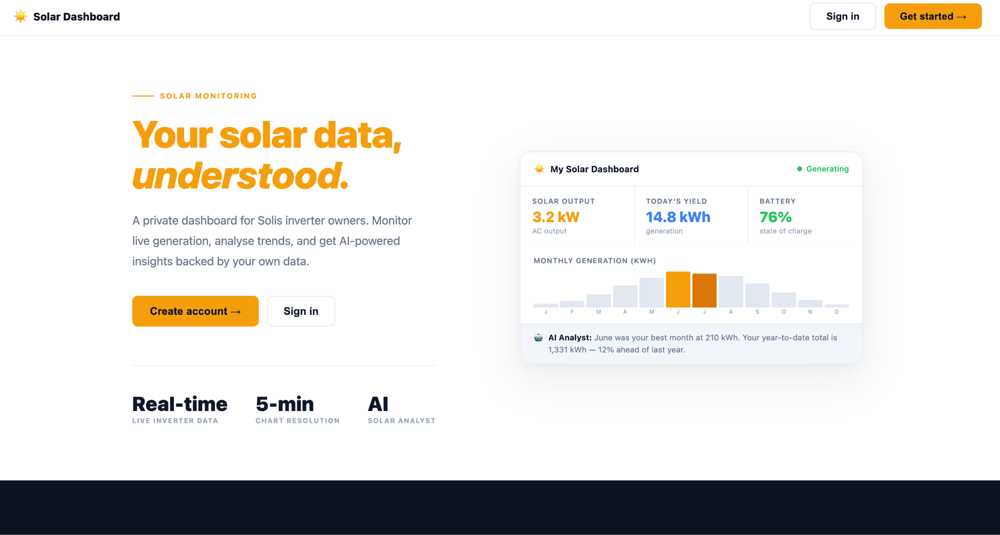
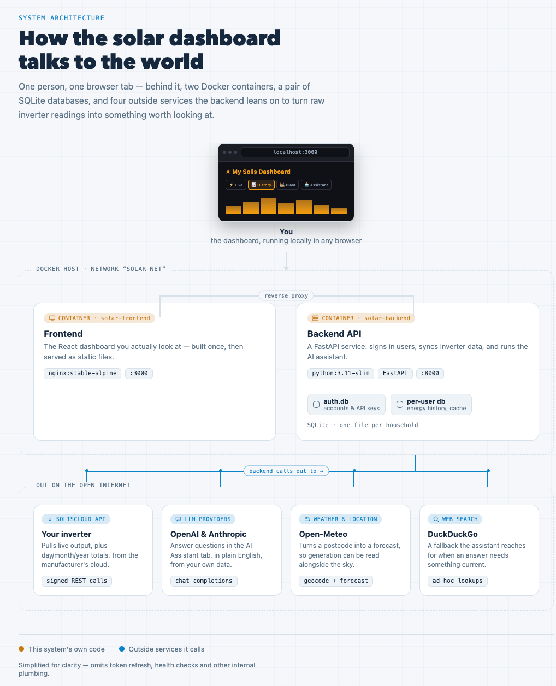
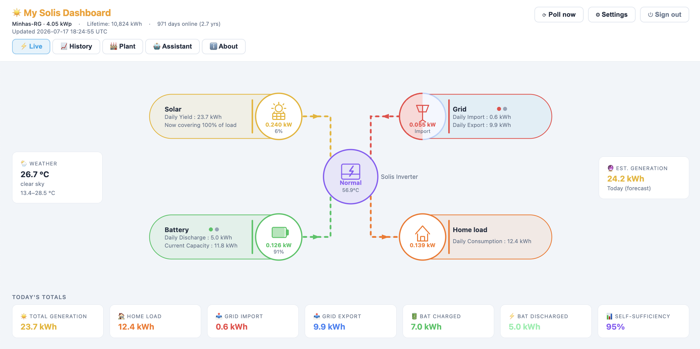
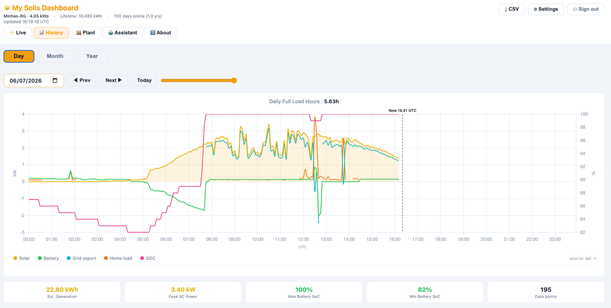
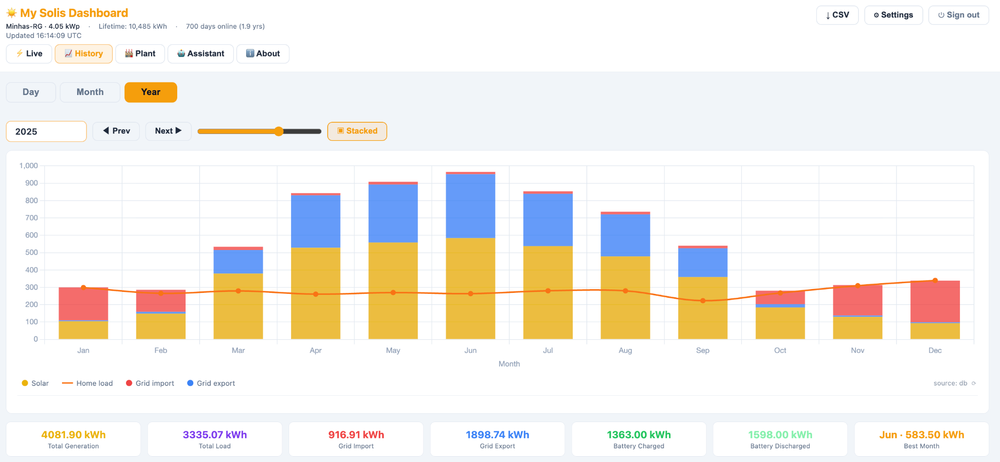
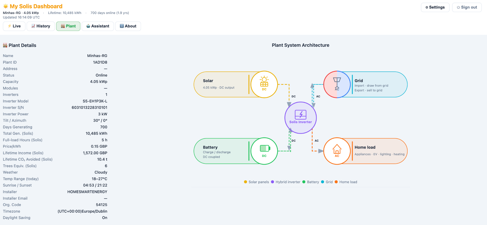
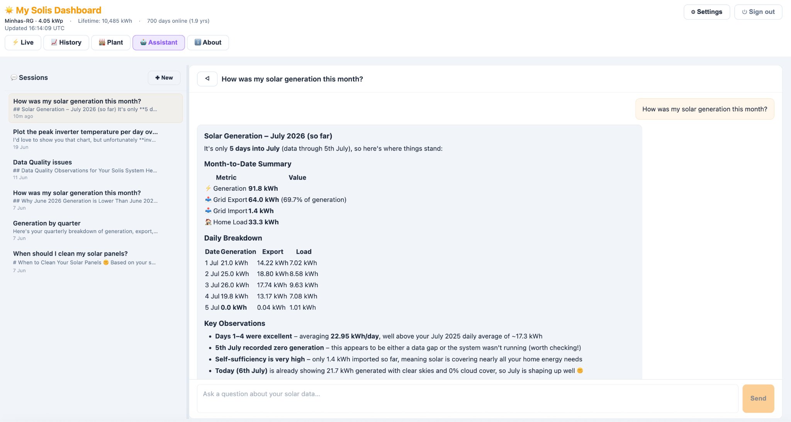

A lot has changed since my last ClimateCTO post in late 2024. The energy shock from the unresolved conflict in the Persian Gulf has put security of supply back on the front page, and the potential impact could get a lot worse yet. Underneath that shock sits a longer-term, structural change. The rapid expansion of AI has profoundly shifted projections for future energy needs. Hyperscalers are making gargantuan commitments to build out data centres, which will drive significant new demand for electricity and water usage that will play out over many years and impact their ability to achieve their stated Net Zero targets. The first of these is a jolt, the other a trend. They both point in the same direction though. Energy is back as a geopolitical issue, and electrotech has risen with it as a strategic concern worldwide. There is now a profound sense of urgency in many countries to develop energy policies focussed on renewables which offer much greater reliability in times of trouble. As environmental campaigner Bill McKibben [strikingly put it](https://open.substack.com/pub/billmckibben/p/sunlight-travels-93-million-miles-63b) in March:

> Sunlight travels 93 million miles to reach the earth. None of them through the Strait of Hormuz. … Those photons then strike the silicon atoms in a photovoltaic panel, knocking loose electrons that produce a stream of direct current electricity; an inverter converts that to AC power.

The renewed focus on solar for energy security in 2026 has sparked my curiosity. It has encouraged me to take a more hands-on approach to understanding my home solar setup after gaining experience with its day-to-day operation over the last couple of years. It also allowed me to finally use some of my learning form [an online course in renewable energy](https://courses.edx.org/courses/course-v1:DelftX+EnergyX+3T2023/da902bf20fd4433a90430e0eea0c7ea5/) I completed in 2024.

I was initiated into the world of residential solar in late 2023 through my local council in Berkshire UK. They have a partnered with [Solar Together](https://switchtogether.co.uk/solar-and-battery) who organise group purchase across the area to lower the cost for households. I arranged to put in 10 JA Solar Tech panels, 4 PylonTech batteries of 3.2kWh capacity each and one hybrid Solis PV (photovoltaic) inverter. I also installed mesh around the panels on advice from others who had panels for years. I’ve noticed that those that don’t have mesh seem to be more likely to be frequented by pigeons.

My install has been functioning smoothly for well over two years now generating around 4MWh per year over the last couple of years. It’s been satisfying to see the panels crank out a couple of dozen kWh of electricity for export on sunny summer days. It’s also been a pleasant surprise how much money can be made from that export racking up over time. With a Solar Export Guarantee (SEG) via [EDF’s Export 12m tariff](https://www.sunsave.energy/solar-panels-advice/exporting-to-the-grid/edf-export-tariff), I get paid 15p/kWh for everything pushed out onto the grid by the inverter. Even accounting for a dual-fuel household with a gas boiler still contributing to costs, the value of what I generate is greater than what I pay for both gas and electricity imports combined for seven months of the year.

### **Solis Inverter API**

I frequently check into the mobile version of the Solis consumer app on the go. It has allowed me to keep tabs on my solar use. I look forward to the dopamine hit on sunny days when I see how much energy the panels have generated. However, I have found their app difficult to navigate from a design perspective. It feels overcomplicated and makes it hard for me as a user to pick out key signals and insights from the data. It also doesn’t get updated very often and has a poor rating. For over a year, I have wanted to build my own report capability using AI support as I did with the tool to analyse my EDF bilI which I covered [in a previous blog post](https://climatecto.substack.com/p/building-a-personalised-energy-report). Unfortunately there doesn’t appear to be any equivalent method to download my inverter data as a csv for local analysis, so I have been marooned with the current experience. I recently became aware through an ex-colleague that it is possible to obtain cloud access to your Solis inverter [via their Solis Cloud platform](https://solis-service.solisinverters.com/en/support/solutions/articles/44002212561-request-api-access-soliscloud). It can be enabled on request during setup by your installer or post-installation by talking to Solis directly. So I contacted Solis Europe support who were admirably responsive. Within a day or so I had an API key for my inverter on Solis Cloud. I then built a simple Python command line script to pull my data from my Solis inverter using that API key. I was emboldened by how much progress I was able to make using their [API documentation](https://doc.soliscloud.com/en/20.API%20documentation/01.SolisCloud%20Platform%20API%20Document.html).

There are two types of access you can gain to your Solis inverter, namely monitor and control. The former allows you to read data and that is what Solis provides through the API. The latter allows you to write instructions for the inverter to execute. Examples include enabling/disabling export mode. This capability is used by more advanced householders to dynamically micromanage their setup in conjunction with a flexible tariff like Octopus Energy. In that scenario you can exercise energy arbitrage by topping up your batteries from the grid when prices are low and discharging them when prices are high. Solis themselves announced their own entry into this space with [an AI-powered upgrade to their platform](https://www.solisinverters.com/global/conews/AI-Driven_Dynamic_Tariff_Optimization_gl.html) to support precisely such a scenario providing this analogy:

> To ace in the game, you need a good Home Energy Management System (HEMS). Think of it as having a Wall Street trader living in your inverter, constantly buying low, selling high, storing and using energy at the perfect moments. By simply shifting consumption patterns, users can save 20% of their electricity bill (€200–€300 for a typical European household), hence reducing payback time of their solar and storage investments by as much as 2 years.

You will need to contact your original installer in order to gain control access to your own inverter post-install. It’s worth being aware of this dynamic before you start an installation if you’re considering one as it’s a lot easier to do it all then when configuring the system for the first time.

### **Solar Dashboard App**

Once I had basic monitor access verified, I started working on a personal web app called **Solar Dashboard** building on the data provided by the Solis Cloud API. The shape of development was guided by the existing Solis app features, albeit simplified and streamlined. I wanted to reuse the information architecture already provided by Solis since my primary focus was on building a simpler interface for communicating that information to users. To use the Solar Dashboard app, a user first has to register then sign in via the landing page:

Diagram 1: Solis Dashboard app landing page

For the technically curious, the app architecture is built around two core components, a FastAPI backend and a React-based frontend. The backend has an integrated relational database that is used as a read through cache for storing value read from the Solis Cloud API. That keeps the number of calls to the Solis platform to a minimum and results in snappier performance. The backend communicates with the React frontend via a documented Swagger API. A comprehensive test automation in place using `pytest` for the backend API and `playwright` for the frontend. The whole setup is dockerized into two containers but it only runs locally on my laptop right now.

I experimented with using three different AI coding agents across the build. The bulk of the initial work was supported by pi.dev with DeepSeek v4 Pro as well as Cursor with Sonnet 4.6 which are relatively cost-effective. Later down the line, I found myself using Claude Code with Opus 4.8 to fix more complex issues.

The system architecture infographic below was generated by Claude as an artifact and provides a high level view of how the Solar Dashboard app works end to end.

Diagram 2: System Architecture

Once logged in, the user needs to enter three Solis Cloud credentials into the app’s Setting panel:

* Key ID
* Key Secret
* API Base URL

Upon valid configuration, data starts being pulled from Solis for your inverter. The frontend exposes five views to users which are described in the following subsections.

#### **Live View**

Provides insights into the current system performance including power flows and accumulated totals for the day. Units are kW for power and kWh for energy throughout. Colour coding matches across all the five views as illustrated here with solar panel generation in yellow, grid import in red, grid export in blue, battery in green and home load in orange. Support has also been added to display the current weather and temperature shown on the left and estimated total energy generation for the day on the right which is updated periodically.

Diagram 3: Solis Dashboard Live View

#### **History View**

Provides insights into the historical data over time either by Day or Month or Year. Day view is a line graph showing solar generation, battery, grid export and home load in kWh and Status of Charge (SOC) in purple as a percentage. These values are reported every 5 minutes. The current picture at time of writing, another sunny early July day in England, is shown below. SOC ramped to 100% before 8am.

Diagram 4: Solis Dashboard History View by Day

Month and Year views are bar graphs. The Year view for 2025 provides a compelling snapshot for data storytelling purposes of a typical residential solar generation profile in the UK over the course of a year. The blue here highlights exports to the grid during March-September when solar generation peaks. The red shows grid imports which dominate over Winter in November, December and January.

Diagram 5: Solis Dashboard History View by Year

#### **Plant View**

Provides information on the system configuration and data extracted from the API. It shows how the solar panels generate DC electricity, which the hybrid inverter converts and directs either to charge the batteries, supply the home, or export to the grid. The inverter also manages battery charging and discharging, household demand, and the import and export of AC power from the grid, continuously balancing these energy flows in real time. In effect, the inverter acts as the central orchestrator of the entire energy system.

Diagram 6: Solis Dashboard Plant View

#### **Assistant View**

The Assistant View contains an AI chat interface you can use to ask questions of your solar setup. You need to bring your own key (BYOK) for supported Anthropic or OpenAI models by adding them in the app’s Settings. The Assistant has access to all the underlying user data stored in the accompanying database which allows it to answer questions by referencing and even graphing that data if asked. It also has access to a weather API and can use web search to answer queries. You can create multiple sessions and they remain accessible in the chat history listing on the left hand side. The assistant has built-in guardrail support and comes with some ready to go UI “pills” you can click to generate responses such as:

* How was my solar generation this month?
* When should I clean my solar panels?
* What’s my grid import vs export ratio?
* How can I reduce my electricity costs?
* Search the web for solar panel maintenance tips

The current incarnation of the Assistant is fairly basic, and not multi-turn. It could evolve over time into a more sophisticated virtual personal energy assistant able to use agents to take action on your behalf once control access to the inverter is enabled.

Diagram 7: Solis Dashboard AI Assistant View

#### **About View**

Provides some more background information on how the app works and how to configure it as well as FAQs.

### **Reflections**

The core tension revealed by the Year data in the History View is that there are significant seasonal impacts when running a solar setup in the UK. This is a structural challenge resulting from variation in daily solar flux and hours of sunlight in a relatively northerly latitude. Batteries can help but they operate on a diurnal basis. They can’t smooth over seasonal variations. Looking at the data, an approximate 3-4 times overbuild equating to 30-40 panels would be required to move from around 60% to 100% year round energy independence for this size of residential install. There is a parallel here with the national picture. My own back-of-envelope overbuild numbers are a single household illustration of a much bigger, under-discussed reality. Closing the gap on renewable self-sufficiency means building far more generation capacity than looks “necessary” on paper with overbuilding as the rule, not the exception. That’s a harder sell to the public than it sounds, and I suspect it remains one of the least understood aspects of the electrotech transition. The underlying rationale is detailed in [Stellar](https://stellarworld.com/), an inspiring book by James Arbib and Tony Seba which explores our collective species transition from the extractive fossil fuel era of our past to a regenerative “stellar” era of the future.

### **Next Steps**

This exercise left me with a practical question, separate from the broader macro trend around residential solar. If seasonal variation and post-install blindness are this common, why is nobody helping homeowners make the most of their investment? There is surprisingly little support for them after they’ve started out with solar as equipment manufacturers and installers tend to concentrate their efforts on the installation process rather than post-install. I share Solis’s emerging hypothesis that homeowners would like more insights into their personal energy usage and would welcome advice on how to lower their costs and improve their ROI on their solar setup. So I am exploring how to turn this into a broader consumer proposition for homeowners extending it to integrate with other inverter manufacturers.  Get in touch you are interested in any way.
