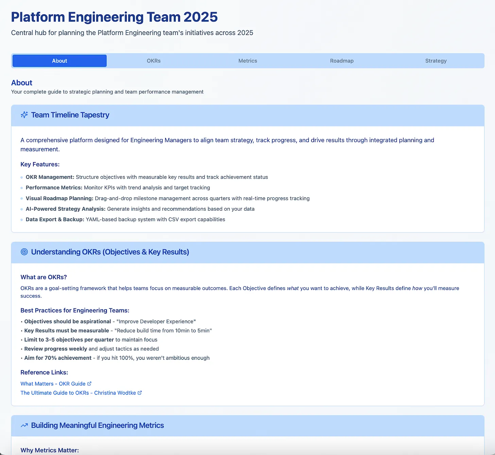
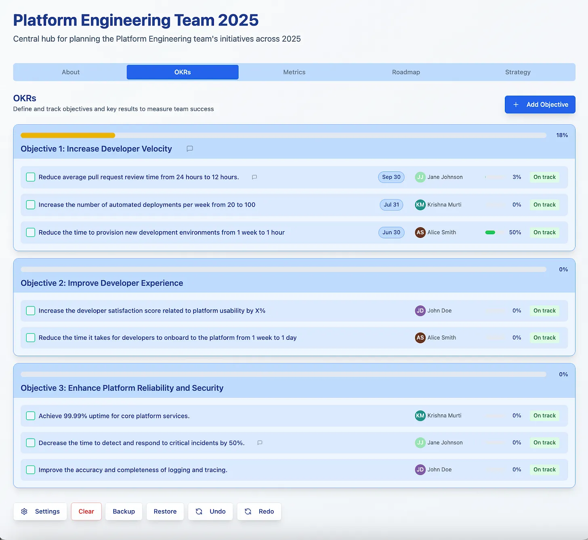
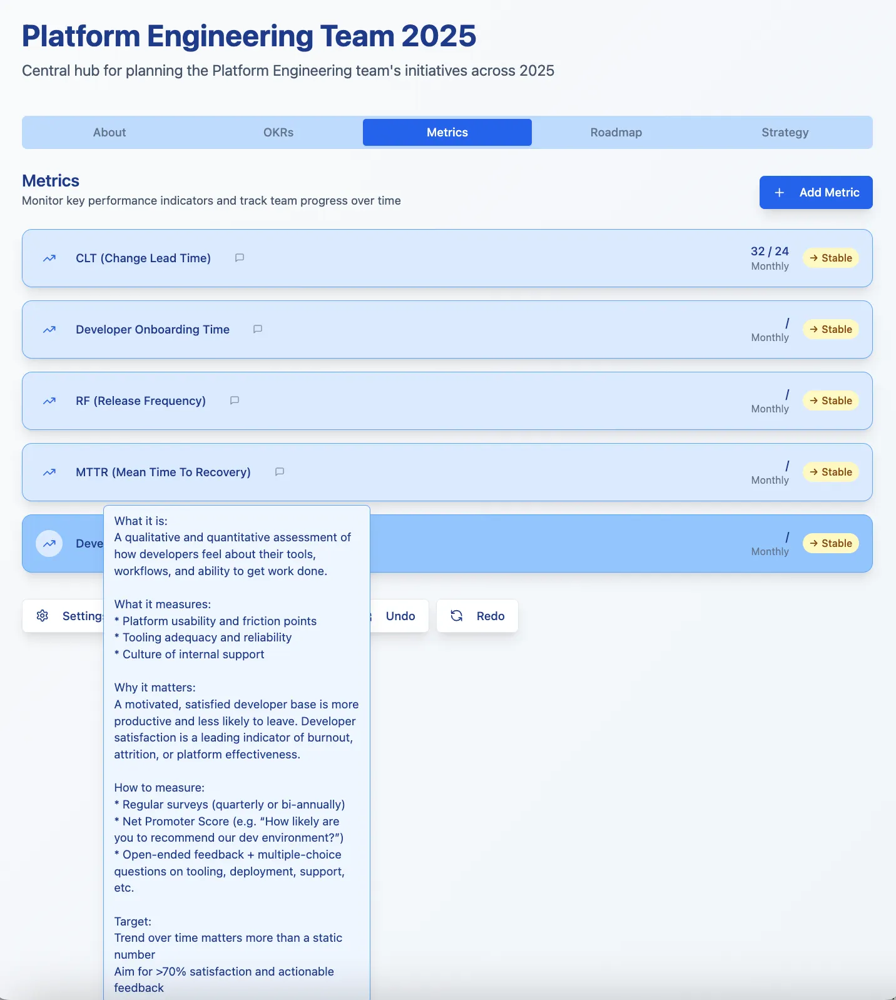
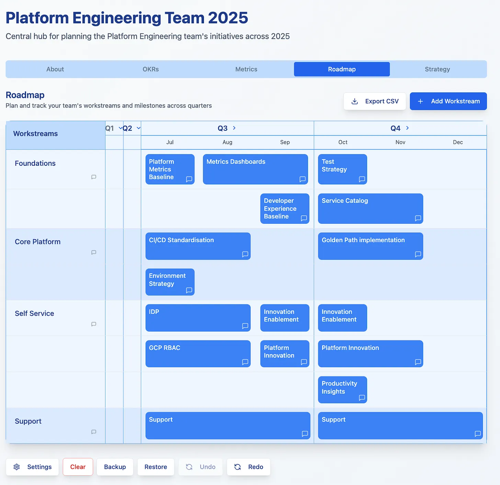
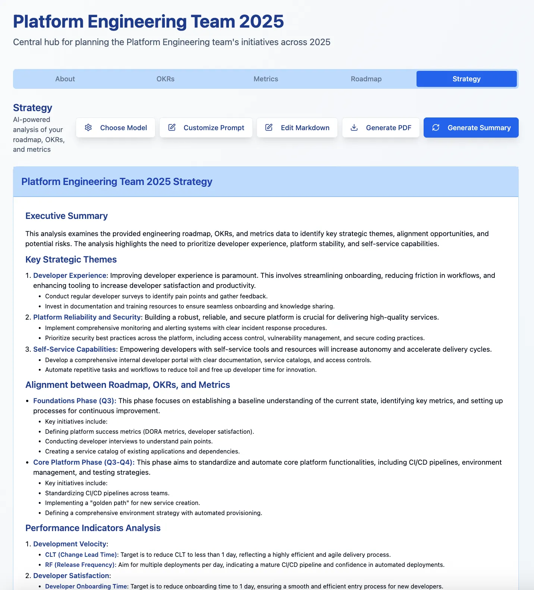

In my experience of working with tech teams in the UK, they can find it difficult to construct effective OKRs (Objectives and Key Results) and then convert those OKRs into metrics and an opinionated roadmap. This can be especially challenging for Platform Engineering teams who frequently feel disconnected from the more tangible outcome-driven orientation of their Product Engineering peer teams. Even the latter latter can struggle to disambiguate input and output metrics though. While OKR discipline is typically well established in leading edge and big tech companies, OKRs tend to be less consistently understood or implemented across the broader SME and startup landscape. To help address this in my current engagement, I have developed [Team Tapestry](https://dioramaconsulting.co.uk/team-tapestry), a web application specifically designed to help Platform and Product Engineering teams align OKRs, metrics, and roadmaps in a single, focused environment. I’ll detail below how it can help support teams during quarterly and annual planning. First let’s dive deeper into OKRs and metrics.

## Metrics in Mind

**Output metrics** represent the results of business activities. They are _lagging indicators_ that reflect what has already happened. Examples include revenue, profit, market share, or Net Promoter Score (NPS). Output metrics are important for a business, but they should not be used as OKRs for a team because they are not directly within the control of any single team or leader.

**Input metrics** in contrast focus on the actions or processes that drive those outcomes. These are _leading indicators_ and tend to be more actionable. Examples might include website performance, customer service response times, product catalog breadth, marketing investment, or operational metrics such as mean time to restore (MTTR) or release frequency. These metrics should influence teams and form the foundation of effective OKRs. A quick example should help to clarify the distinction:

> ❌ **Poorly Constructed OKR**
>
> **Objective**: Increase customer satisfaction
> **Key Result**: Raise Net Promoter Score (NPS) from 45 to 65
>
> **Why it's a problem**: While the intent is valid, NPS is an output metric, a lagging indicator that reflects the outcome of many factors, many of which may be outside the control of the team. It's difficult to know what actions will move the needle, and progress may not be visible until well after the work is done.

> ✅ **Improved OKR (Input-Focused)**
>
> **Objective**: Deliver a faster, more responsive user experience
> **Key Results**:
> 1. Reduce average customer support response time from 24h to under 6h
> 2. Decrease website page load time from 3.5s to 1.8s
> 3. Increase percentage of resolved support tickets on first contact from 60% to 85%
>
> **Why it's better**: These key results are input metrics, leading indicators that the team can directly act upon. Each is tied to an operational improvement that has a clear and measurable impact on customer experience, which in turn is likely to improve the output metric (NPS). This OKR provides clarity, focus, and a path to execution.

Well-constructed OKRs tied to input metrics provide the strategic signal that informs your team’s roadmap. What to we mean by a roadmap? In essence it is a programmatic, forward-looking opinionated plan for how you believe your OKRs will be achieved. This alignment between vision, execution, and measurable outcomes is critical for high-performance delivery.

Tooling to support this kind of structured thinking around OKRs can be expensive or simply missing in SMEs. Many teams still rely on generic solutions such as Google Sheets and Slides, which offer flexibility but lack integrated support for tracking OKRs, metrics, and roadmaps in a cohesive way. If you are lucky enough to have a [Product Operations](https://www.svpg.com/product-ops-overview/) team, they may have built something internal to support quarterly planning. More often than not, its all done last minut in slides you can’t find next time around. Its also worth adding that in situations of OKR immaturity, another emergent anti-pattern is obsessive focus on getting everything perfect and detailed. That might help at Google where OKRs originated but your business is not Google so keep it simple with OKRs and metrics as follows:

- Don’t have too many - a rule of three approach for OKRs is great.

- Don’t make them too complicated - OKRs should be relatable to everyone.

- Don’t make them impossible to measure - manually gather data if necessary.

- Don’t worry about dashboards - use a spreadsheet if you have to at first.

- Don’t forget what's actually important for your business.

## Enter Team Tapestry!

The initial motivation for [Team Tapestry](https://dioramaconsulting.co.uk/team-tapestry) was twofold. Firstly to build a freely accessible and easy to use web tool that would help provide some useful links and background on OKRs, metrics and roadmapping for those new to the discipline. Secondly, to create a one-stop secure shop for keeping this information together complete with backup and restore functionality that was useful enough to encourage regular access and check-ins on progress. A stretch goal was the generation of strategic guidance for team members based on input data using AI.

The app has been built with support from Lovable and Cursor. Various features have been added for improved usability based on feedback from initial users:

- **Views**: Five Views have been created - About, OKRs, Metrics, Roadmap and Strategy.

- **Themes**: Three themes are currently available: Light, Blue, Emerald. They consistently change colours across all panes.

- **Backup/Restore**: You can backup and restore your data as YAML. An example file is presented which gets you started.

- **Undo/Redo**: You can now undo and redo the last N changes. N, the number of undos supported, is configurable in Settings.

- **Team Members**: It is possible to set team members who can then be chosen from a selector dropdown for OKRs.

- **Editability**: Almost everything in the Views (apart from About) is editable by clicking including the title and subtitle.

- **Security**: The production web app is housed in a Docker container. No personal data is stored or logged. This does mean it is your responsibility to ensure you back up your own data.

Screenshots of the five main views are presented and explained in the following sections.

### About View

The About View provides some basic background reference material and links for those new to OKRs. Guidance is also provided on best practice. Further down the View, one can load an example file for a fictional Platform Engineering team built into the app. Supporting Platform Engineering was the initial impetus for the app hence the links to Google’s DORA metrics which should be familiar to SREs everywhere.

### OKR View

The OKR View allows users to manage Objectives and Key Results. Click on Add Objective to add one of those. When you hover on an Objective title you see an edit icon appear and a `+` at the end of the Objective to allow you to add a Key Result. Clicking on an OKR allows you to change the target, set the progress and name an owner and due date. Clarifying explanations can be added to Objectives and Key Results and viewed by hovering over the comment icon. Owners are chosen from a selector from a list configured in global Settings. OKRs could be reviewed by an AI in the future and improvement suggestions provided for the user at the point of entry.

### Metrics View

The Metrics View provides the ability to add, edit and track progress on Metrics linked to OKRs. Clarifying comments can be added to Metrics and viewed by hovering over the comment icon. The screenshot below shows how detailed this comment can become. In this case the comment relates to a metric for Developer Satisfaction. You can drag and drop to rearrange the metrics moving them up or down the list. This view is currently quite basic but in the future could be a lot more funky with the ability to enter data via a .csv file for instance and generate integrated dashboards.

### Roadmap View

The Roadmap View helps users manage a roadmap. It is organised into Workstreams and Milestones. A Workstream is a horizontal swimlane container that stretches from Q1 to Q4. Clicking on a Workstream allows you to edit it to change its name and description. As with OKRs, when you hover on a Workstream title you see an edit icon appear and a `+` close to the Workstream name. Clicking on the `+` allows you to add a Milestone. Milestones have a starting quarter and month and can be an integer number of months in length. You assign Milestones to Workstreams. Milestone blocks can be dragged and dropped within or across Workstreams. You can also click on a Milestone to edit it manually if you prefer. Both Workstreams and Milestones can have comments added in their edit dialogs. These comments can be viewed by hovering over the corresponding icon. Quarters can be collapsed to allow greater focus on the current one for example as shown in the screenshot below where Q1 and Q2 are collapsed to allow us to focus on H2. A vertical red line shows the current date. It is omitted here because Q2 is collapsed. Finally you can export the roadmap as a .csv in case you want to have a look at the data.

Note that currently the app only shows a single year in this View. If there is interest in visualising across more than one year, I can look into adding it. There is also no import from .csv support yet.

### Strategy View

The Strategy View attempts to generate a written strategy for a team based on reviewing and integrating all the information embedded in OKRs, Metrics and Roadmap Views including comments. The guidance is generated using a prompt you can view and modify under the “Customise Prompt” button. Click “Choose Model” to choose the model for the strategy generation. A variety of different LLMs are supported from OpenAI, Perplexity and Groq. It’s a free app so you’ll have to supply the key yourself (sorry!). Groq is the fastest and the one I default to. Click “Generate Summary” to generate your Markdown summary shown below and “Generate PDF” to open it in a new tab ready for printing or converting to a pdf. Note that this is a proof of concept and no evals have been developed; it’s pure vibes based on very limited use! I will need to build an eval set over time for Strategy View.

## Closing Thoughts

[Team Tapestry](https://dioramaconsulting.co.uk/team-tapestry) has proved helpful for me and I hope it will do the same for you and your team. Building it as a personal app for myself initially has been rewarding and fun. Coding AI tools are now making it possible for individuals to build something in code in hours to address a personal itch. Etienne de Bruin of 7CTOs [recently posted](https://ctosub.com/p/when-did-you-stop-building-for-joy) on why doing so is really important. It allows senior leaders to reconnect with the creative urge to develop working software. The same urge drove many of us into tech in the early part of our careers:

> Here's what happens to most of us who become CTOs: we trade our keyboards for calendars. We exchange the immediate satisfaction of solving problems with code for the complex choreography of managing teams and strategies. And somewhere in that transition, we convince ourselves that this is growth, that this is what success looks like.
>
> Don't get me wrong—leading technology organizations is important work. But when we completely disconnect from the act of building, we lose something essential. We lose our intuition for what's possible. We lose our empathy for the developers we lead. Most importantly, we lose the joy that brought us to technology in the first place.

I’m genuinely surprised by how much it is possible to create just through prompting in English aided by coding AI tools like Lovable and Cursor. It feels increasingly important for managers in technical roles to get up to speed on [vibe coding](https://en.wikipedia.org/wiki/Vibe_coding) because maintaining their position may depend upon it. These tools will only become more effective over time and as they do, it will create pressure across sectors from Big Tech to SMEs to shrink tech team sizes. That dynamic feels inevitable as owners will scrutinise Revenue/FTE figures of AI native competitors and ask why their companies can’t operate the same way. Organisation design will shift from cross-functional concerns to very small teams getting things done fast by operating in permission-free development mode. As Elena Verna of Lovable [put it recently](https://open.substack.com/pub/elenaverna/p/the-rise-of-the-ai-native-employee):

> - **Operations roles** that only exist to herd cross-functional chaos? Gone.
>
> - **Managers** with **no vertical skill**, acting as coordination layers? Extinct. And thank goodness.
>
>
> We’re not replacing people. We’re replacing bloat. The rise of AI-native employee means the fall of organizational calories that don’t create value.

Hopefully [Team Tapestry](https://dioramaconsulting.co.uk/team-tapestry) can play a small role at the dawn of the AI-Native era by helping your team tame OKRs, metrics and roadmaps in the new world. Freeing them up from fiddling with slides and spreadsheets or having to ask program managers to assist.

Please feel free to get in touch if you find the app useful or have feature requests.
