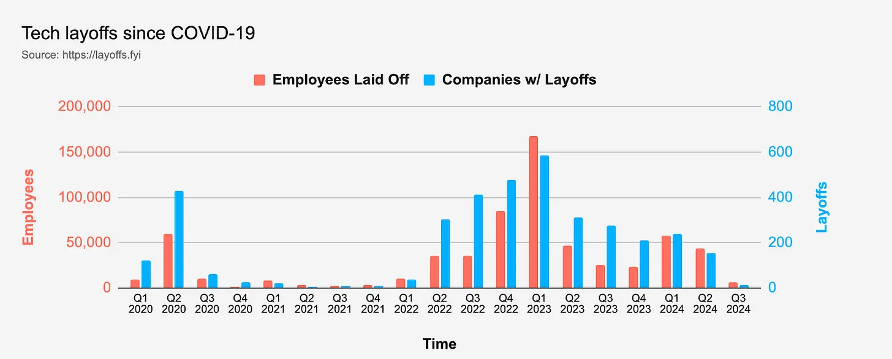
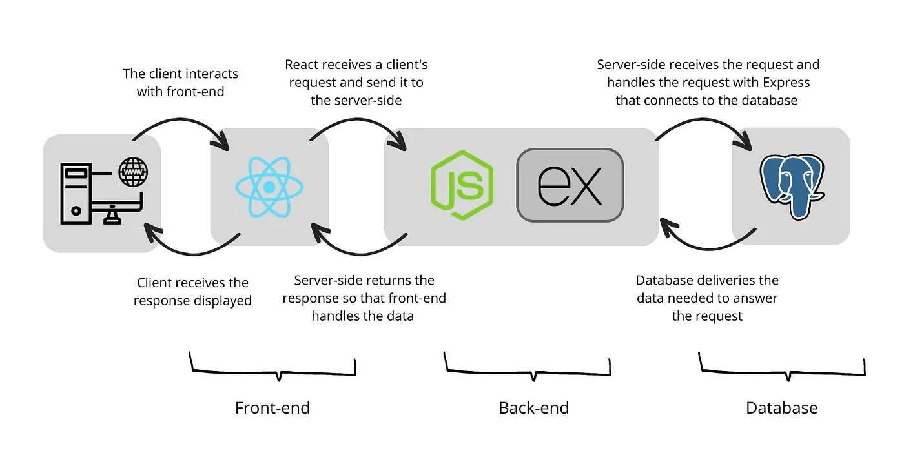
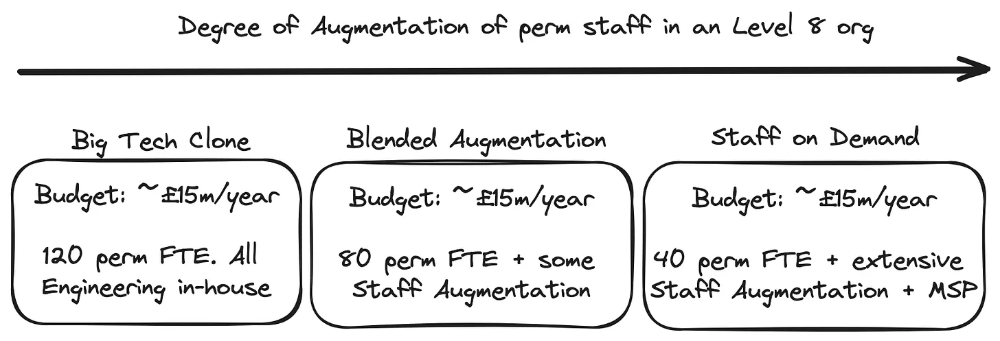

London CTOs will shortly be hosting a panel session entitled [Crafting Teams With Balanced Skills for Tomorrow’s Tech Challenges](https://www.eventbrite.co.uk/e/crafting-teams-with-balanced-skills-for-tomorrows-tech-challenges-registration-939474402227). The event is likely to raise lots of interesting discussion points about how to tackle this challenge. As one of the panellists I will be hoping to provide some of my own insights on the day. I thought it would be useful in advance to write an article that breaks down the three elements we will be covering and tackle each one separately:

1. Crafting Teams

2. Balanced Skills

3. Tomorrow’s Tech Challenges

The rest of this post walks through each of these in turn in reverse order because it seems to make most sense to start at the end of the list and work backwards.  

### Navigating a new Business Reality for Tomorrow’s Tech

Tech leaders are in a difficult and challenging place right now. Since the end of 2021, a new business reality has emerged which has changed the way many tech-centric companies operate and are internally organised and structured. As others [such as Gergely Orosz](https://newsletter.pragmaticengineer.com/p/zirp-software-engineers) have noted, we are now in a post-ZIRP (Zero Interest Rate Policy) era. Business focus has shifted towards maintaining financial stability and breaking even. This has resulted in greater scrutiny on improving productivity and lowering staff cost base.

Mass layoffs, once considered a last resort, have unfortunately become normalised in tech over the last couple of years. Diagram 1 taken from [layoffs.fyi](https://layoffs.fyi/) suggests that the situation has improved slightly this calendar year (CY24), but the threat of layoffs is never far off. This makes it crucial for companies to keep their permanent employees transparently informed about the financial situation. Regular, honest and sensitive communication with staff is essential to maintain trust and morale.

In the current environment, businesses face increased pressure to demonstrate a return on investment (ROI) in their engineering efforts. This often leads to tough conversations at leadership level about resource allocation and how tech resources translate to business success. Questions about performance and capability have risen in frequency with frequent exhortations to do more with less. There is no universally recognised way of assessing the performance of an Engineering organisation. A mixture of approaches are necessary to form a data-led view of what’s really going on. Quantitative frameworks such as [DORA](https://dora.dev/) or [SPACE](https://blog.codacy.com/space-framework) can be used to gather metrics such as pull request cycle time and release frequency that help uncover underlying team process issues. Qualitative surveys also play an important part allowing developers to articulate pain points. The metrics that investors are often interested in, however, are [Revenue per FTE (Full-Time Equivalent)](https://www.investopedia.com/terms/r/revenueperemployee.asp) and [R&D Intensity](https://en.wikipedia.org/wiki/R%26D_intensity), the proportion of overall Revenue allocated to tech within the yearly budget of a company. Private Equity firms typically benchmark their portfolio companies against comparable businesses using these metrics. Doing so can result in questions around tech staff productivity and ways to improve it. Operating in such an environment can raise issues around psychological safety and job security; conversations about [talent density](https://www.perplexity.ai/search/what-is-meant-by-the-term-tale-3znNEOpNSvyVRnh8TL8X0w) and underlying business uncertainty can be challenging. The [recent announcement of 1800 layoffs by Intuit](https://www.reddit.com/r/recruitinghell/comments/1e1e4mp/intuit_laid_off_1800_people_and_called_them/?rdt=64127) in which many of them were publicly labelled as “underperformers”, highlights how poor communication can exacerbate tensions and anxieties. The harsh reality is that job security is no longer a given in many companies. Individuals have to operate a growth mindset and take it upon themselves to ensure they have the skills needed by companies of the future. Advances in AI are likely to shift the pendulum even further towards talented individual contributors in the future, particularly those with good soft skills to complement their technical ones.

In this new world, the roles of Product and [Product Marketing Managers (PMMs)](https://www.rocketblocks.me/blog/diff-pm-vs-pmm.php) have gained prominence. There is a growing emphasis on product and marketing strategy, reflecting a shift in how companies drive value through products and services. It’s important for them to think strategically and address technical debt as early as possible to ensure the business can go faster later. An additional concern is ensuring the allocation of resources between impact-driving product work and platform engineering or tech debt work is properly considered.

Arguably, the role of Engineering in this mix has declined and it is now just one part of a multi-disciplinary matrix. Its role is to work with other stakeholders, notably Product, to drive business outcomes. Engineering as a result is becoming more **outcome-oriented** as discussed in greater detail in [this previous post](https://malm.substack.com/p/outcome-driven-engineering) and those outcomes are increasingly steered by business and Product leaders using prioritisation frameworks like [IDEO’s DVF (Desirability, Viability, and Feasibility) triad](https://makeiterate.com/ideos-desirability-viability-feasibility-framework-a-practical-guide/). Feasibility concerns in many cases are a secondary consideration relative to Desirability and Viability. It is generally assumed that the technology required to deliver business outcomes can be built or bought and integrated. This shift underscores the evolving nature of business strategy and the critical need for companies to adapt to stay competitive. It’s worth noting and acknowledging the huge stress and pressure the new business reality places on tech leaders themselves as they face the daunting task of navigating a path for their teams through all these complexities. Burnout is a real risk for leaders themselves.

### Balancing Skills and Teams

Modern software development is an increasingly complex job. Beyond the core software development skill sets acquired through formal education, developers also need to acquire a vast array of auxiliary contextual knowledge it is harder to teach. They need to understand software architecture and design patterns. They need to master a lot of different tools and frameworks, many of which they may not have been exposed to at college. They need to do all this while staying constantly updated with the latest tech advancements. Given these demands, [Developer Experience (DX)](https://github.blog/enterprise-software/collaboration/developer-experience-what-is-it-and-why-should-you-care/) has become crucial in reducing the cognitive burden on developers. The encapsulation of [golden paths](https://cloud.google.com/blog/products/application-development/golden-paths-for-engineering-execution-consistency) for developers using templates and code generation allows them to work more effectively.

The importance of full-stack developers in the mix has become greater, in part to align with the need to increase Revenue per FTE and the broader goal of doing more with less. This shift is often accompanied by an intentional move towards TypeScript-first teams using paradigms such as [the PERN (PostGRES, Express, React Node) stack](https://medium.com/@ritapalves/get-started-with-the-pern-stack-an-introduction-and-implementation-guide-e33c55d09994) for covering the full end to end architecture as highlighted in Diagram 2 below. The idea is that using the same lingua franca at backend as well as frontend simplifies code management and improves team collaboration and productivity. This is often supported with an [Internal Developer Platform (IDP)](https://internaldeveloperplatform.org/what-is-an-internal-developer-platform/) that supports DX goals.

The rise of DX and IDP has resulted in the need to discuss appropriate allocation of resources between product and platform/tools development. The latter is often where tech debt initiatives are located. The right ratio will vary depending on context. 60:40 is a typical benchmark. Establishing a formal separation between the two activities suggests a mature product engineering culture is in place that covers both aspects of tech organisation design [as outlined by McKinsey](https://www.mckinsey.com/capabilities/mckinsey-digital/our-insights/the-big-product-and-platform-shift-five-actions-to-get-the-transformation-right) last year:

> Committing to [engineering excellence](https://www.mckinsey.com/industries/technology-media-and-telecommunications/our-insights/developer-velocity-how-software-excellence-fuels-business-performance) is about more than hiring great engineers. It’s about creating an environment where engineers can thrive by doing work of the highest value, using advanced tools and relying on automation across software development to reduce toil. At its root, this commitment to creating an advanced engineering environment is about focusing on the [developer experience](https://www.mckinsey.com/capabilities/mckinsey-digital/our-insights/tech-forward/why-your-it-organization-should-prioritize-developer-experience).
>
> Creating this kind of work environment requires a commensurate shift in the work that engineers do. Companies should consider allocating 10 to 30 percent of developer capacity to building new engineering and automation capabilities and upgrading skills through tailored learning programs. These capabilities are essential not only to retaining top engineers but also to enabling product and platform teams to rapidly develop quality software.

The importance of cultivating a Product Engineering mindset has become a particularly important ingredient. Here the focus is less on raw coding ability of developers and more on their ability to integrate seamlessly as team players within a multi-disciplinary organisation aligned on common business goals. Soft skills such as curiosity, collaboration and communication are critical, as is demonstrating a delivery-first sensibility. Finding such talent is difficult. The widespread adoption of remote working has enabled companies to look at alternative ways of securing it in recent years. Approaches ranging from hiring remote workers via platforms such as [remote.com](http://remote.com/) and [OysterHR](https://www.oysterhr.com/) to more scaled [Staff Augmentation](https://en.wikipedia.org/wiki/Staff_augmentation) initiatives have become normalised as a result. Often entire remote teams are drafted in, which in addition to being faster than trying to hire everyone organically in a UK context is also often a more cost-effective approach. This shift has created challenges for perm staff because companies often seek immediate solutions, looking to bring in the missing skills they need fast in order to deliver business results quickly, rather than invest strategically in long-term growth through training and upskilling existing employees. There are several challenges with diversifying team configuration this way. Firstly, maintaining a strong one team dynamic can be hard in environments where permanent and contract staff often operating with different cultural backgrounds are working together. Secondly, continuous learning on the job is essential for the successful progress of all developers, especially juniors. As Charity Majors memorably highlighted, software engineering is fundamentally an [apprenticeship industry](https://stackoverflow.blog/2024/06/10/generative-ai-is-not-going-to-build-your-engineering-team-for-you/), and there is a collective duty on all of us in it to support the growth and development of juniors. Finally and perhaps controversially, it’s worth noting that bringing in remote staff can create tensions for permanent staff who typically place higher importance on psychological safety. That concern is frequently linked to job security and work-life balance, leading to challenging conversations about how a business can most effectively address skills matrix gaps and getting the balance right between the different teams.

The pandemic and the shift to hybrid or remote working models have made it difficult for many developers. The rapid advancement and adoption of Generative AI (GenAI) have added another layer of challenge to the situation. As an industry, it is imperative that we improve our efforts to support the engineering growth pipeline, ensuring that the next generation of engineers receives the training and mentorship they need to thrive. Doing so will allow us to construct truly balanced teams and ensure skill distribution across the staff base both permanent and contract.

### Crafting Teams using Target Operating Models

Engineering is undeniably a team sport, but the question remains: how do we best approach building that team? Organisations, especially once they scale, can operate across a target model spectrum that ranges from what may be termed **Big Tech Clone** right the way over to **Staff on Demand** model. This spectrum is independent of budgetary envelope; given a reasonable R&D Intensity, a business could choose to land anywhere on this spectrum in terms of operating model.

The Big Tech Clone model is one which seeks to emulate the likes of Amazon, Google, and Meta by building tech teams substantially in-house. It’s perhaps a controversial point, but too often scaling organisations see themselves as tech-led and therefore duty-bound to adopt a Big Tech Clone approach. They staff their tech organisation with expensive full time staff as a result when in fact they don’t need to because they are really just leveraging rather than creating technology. One rough way to determine how tech-centric a business is to measure its R&D intensity ratio. If it has around 20% or more of its overall revenue allocated to tech then it can, broadly speaking, consider itself to be tech-first. As you scale, this ratio inevitably declines. Many companies, irrespective of how they identify themselves, are merely building product and services offerings that can be largely implemented using commercial off the shelf Software as a Service (SaaS) solutions supported by a relatively small development team on top to glue them together. It is not uncommon for a typical SaaS business for instance to itself be leveraging well over 100 different SaaS solutions in its tech and operations. It’s SaaS all the way down. Although it is not a direct concern of this post, the risk this supply chain complexity poses in terms of InfoSec threats is significant and growing.

At the opposite end of the spectrum is the [Staff on Demand model](https://www.diamandis.com/blog/staff-on-demand-exo) evangelised in the book [Exponential Organizations (ExO)](https://www.amazon.co.uk/Exponential-Organizations-organizations-better-cheaper-ebook/dp/B00OO8ZGC6) by Salim Ismail and others. This approach involves shrinking the permanent team to just a few key leadership roles including Product Managers (PM), Principal Engineers, Senior Engineering Managers (SEM), Engineering Managers (EM) plus Data Engineering and Science staff. These core team members work closely with business leadership to define product architecture, technical metrics, and roadmaps. Delivery is then managed by plugging in entire teams from external partners, which can include both Design and Engineering implementation resources. These external Staff on Demand resources could be supplied either via Staff Augmentation referenced earlier through to Outsourcing or [Managed Service Provision (MSP)](https://en.wikipedia.org/wiki/Managed_services). They can be far more easily flexed quarter to quarter adapting to changing business needs. For a large number of tech-enabled businesses, a variant of the Staff on Demand model may make more sense from a capital allocation perspective than attempting to build the organisational equity to do everything in-house. They operate a smaller fixed base of staff and then flex resources according to business need on top. It’s a model that is likely to grow in significance in the future as explored in this article on the coming wave of [fractionalized employees](https://rishad.substack.com/p/the-next-wave-fractionalized-employees) which is a closely related topic.

Let’s work through this with an example. Consider a hypothetical mature SaaS business which has a revenue of £100m/year and an annual R&D budget of around £15m a year. It constitutes a Level 8 organisation within the [CTO Levels framework](https://ctolevels.notion.site/CTO-Levels-6b06e6afe01844edaedfd396987d559f). Let’s constrain R&D intensity for this organisation to be no more than 15% independent of operating model. Diagram 3 illustrates three different ways of structuring Engineering for this business. The Big Tech Clone variant target operating model has 120 Engineering FTE. For simplicity we will assume that number is reflective of 15% of workforce in line with R&D Intensity meaning that the company has 800 total employees. Revenue per FTE would therefore be £125k per year. [This Perplexity response](https://www.perplexity.ai/search/what-is-a-reasonable-benchmark-a5MsXD1DT4Ki0QaLWLmNJg) provides some industry benchmark comparables for reference:

> A reasonable benchmark for revenue per FTE for a tech business in the UK can vary widely based on the company's size, sector, and maturity. However, for a typical tech company, especially in the SaaS sector, aiming for a revenue per FTE in the range of £125,000 to £200,000 is a good target. Larger, more established tech companies can achieve much higher figures, sometimes exceeding £300,000 per employee.

For this example, as we increase the degree of Staff on Demand, the permanent Engineering base declines in size offering the opportunity to increase Revenue per FTE by having fewer, more capable external FTE to augment the permanent base. The budget for these FTE is effectively defined by what is left over from £15m after perm FTE salaries and Opex overheads are accounted for. This effect is compounded if similar rationalisation can be found in other parts of the business. If the Exec team can provide a compelling commercial growth story on top without requiring a commensurate tech FTE injection, that provides yet another opportunity to increase Revenue per FTE. It is reasonable to assume that these topics would figure prominently at Board meetings for this hypothetical company given it currently sits at the low end of the Revenue per FTE range.

Selecting the right Staff on Demand partner is crucial and there are a large and growing cohort to choose from. Competitive pricing, quality, and speed are all key factors in the selection process. So too is ownership split; Staff on Demand works best when there is very clear separation of delivery responsibility between partner and in-house staff with the ability of the latter to absorb and maintain the work of the former. Other considerations include location and access to a network of local talent. [IR35 regulations](https://www.gov.uk/guidance/understanding-off-payroll-working-ir35) mean that UK-based staff run the risk of being classed as employed for tax purposes. As a result Staff on Demand models typically involve nearshore or offshore teams. Culture and practice fit are therefore also an additional factor in partner selection as mentioned earlier. It's important to note that while all clients want good, quick, and cheap solutions, typically only two out of three are achievable. The factor you should aim to be most flexible with is cost not quality or speed of execution. The goal should be to minimise **time to talent acquisition (TTTA)** and materially raise [talent density](https://www.perplexity.ai/search/what-is-meant-by-the-term-tale-3znNEOpNSvyVRnh8TL8X0w) faster than via organic hiring. It’s unlikely you can do that with the cheapest supplier. If cost is fixed, then scope may need to be reduced to accommodate and post-launch milestones will need to be integrated into planning. That’s ultimately what good partners can bring to the mix - talent acquisition as a service. [This Refactoring post](https://refactoring.fm/p/agencies) on how to work with an agency covers many of these points and emphasises the importance of creating an environment of collaboration not confrontation with Staff on Demand partners.

In today's business environment, access to talent is becoming more important than whether that talent is in the form of permanent staff or not. However, there remains a cachet associated with having tech organisational equity in-house. For organisations who insist on enacting a transition from a Staff on Demand model to a Big Tech Clone setup, the [Build, Operate, Transfer (BOT) model](https://www.torryharris.com/knowledge-zone/build-operate-transfer-bot) offers a viable pathway. This model involves choosing an external partner to build and operate a team and then later transfer that team once it is operating effectively in-house. Alternatively, the organisation could frame contracts that allow them to convert contracted staff to permanent employees at the end of a suitable contract term such as six months. A good Staff Augmentation partner should be able to help facilitate such an arrangement.

All these models come with their own set of challenges, especially in the current economic context. Honest discussions and alignment around growth trajectory, cost, culture and target operating model are necessary at Exec and Board level to properly navigate the various trade-offs. Ultimately, the approach a business takes to crafting its tech organisation and the target operating model it selects requires careful consideration of a company’s fundamental purpose and how it drives attitudes to goals, resources and budget.
