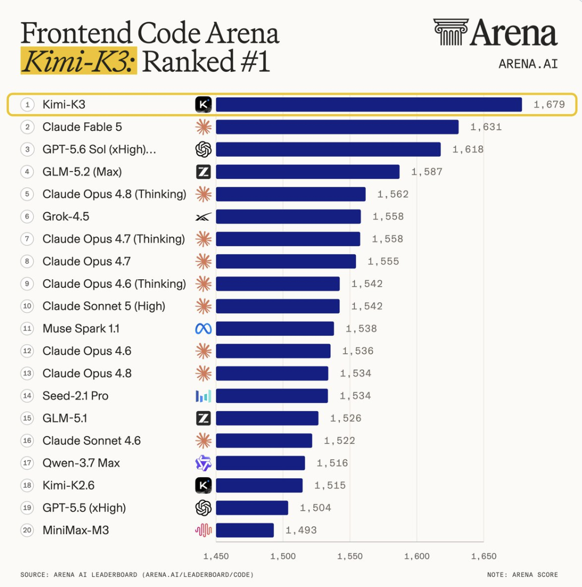
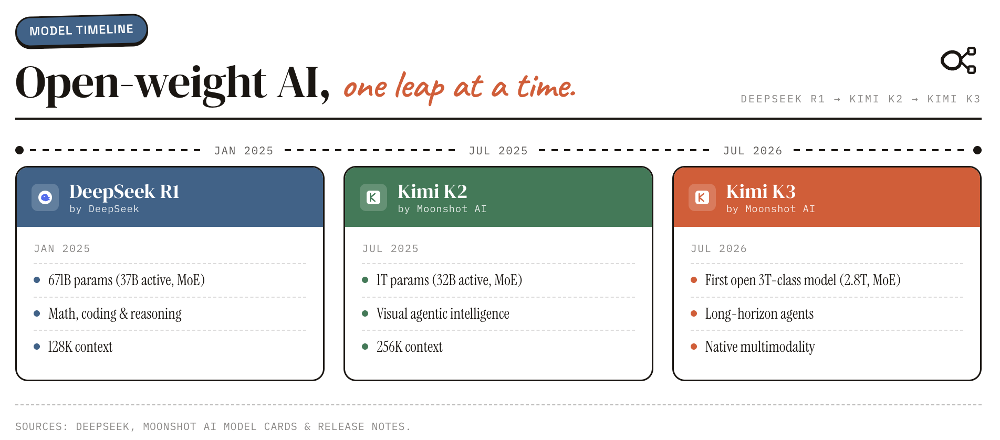
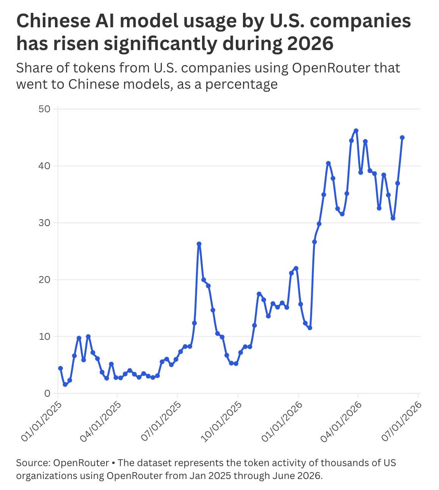
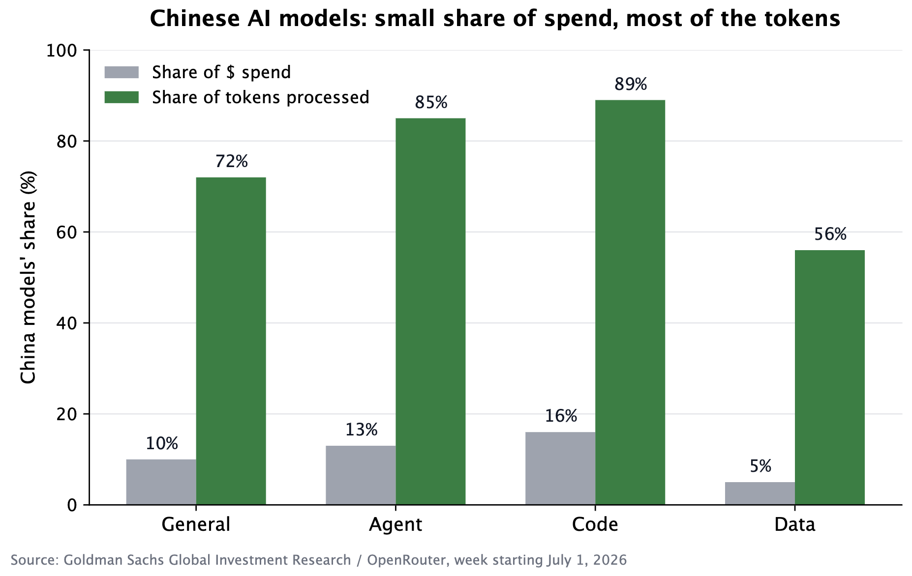
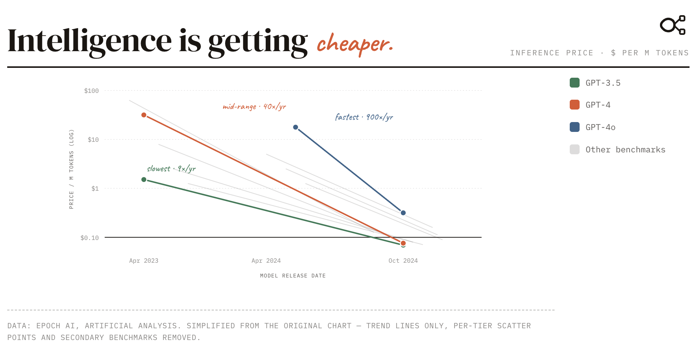
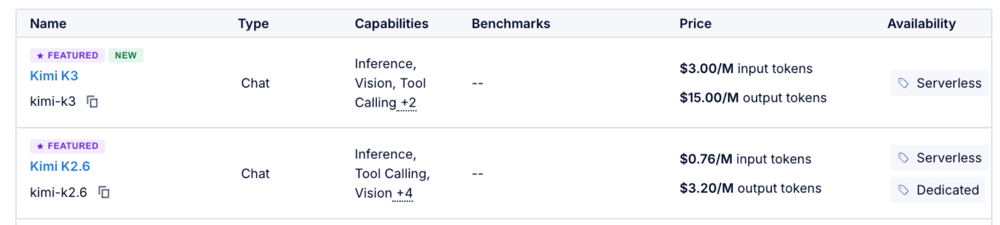
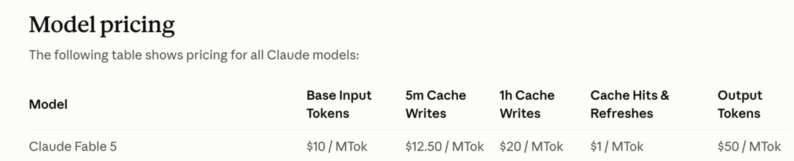

We have been busy learning about Chinese frontier models, which has dominated coverage these past few weeks.

Today’s post will cover the latest and most advanced model [Kimi K3](https://www.kimi.com/blog/kimi-k3) launched earlier this month from Chinese Lab Moonshot AI. This is very relevant because Kimi K3 is an open-weight model meaning that, in theory, anyone with sufficient infrastructure can download and run it for a fraction of the cost of US frontier models.

This is now the third time in 18 months that a Chinese lab has released a model that jumps to the top of a leaderboard and triggered a wave of concern in the US. However, in the past, usage has settled into a more complicated reality once people test the model properly. But each cycle has narrowed the gap with the best US models a little further. To the point that we don’t know anymore who is ahead. But does it really matter to the end user? This is what we are trying to understand…

K3's price advantage may prove smaller in practice than advertised, but something looks different this time. [Microsoft is already testing K3 for Azure and Copilot](https://www.theinformation.com/newsletters/ai-agenda/new-kimi-k3-model-means-u-s-china-ai-race), and the industry needs cheaper models, as [Satya Nadella told the Wall Street Journal in June](https://cybernews.com/ai-news/microsoft-deepseek-china-ai-race-satya-nadella/).

Clearly a shift is underway. Leaders now operate in a world with several credible model providers, where the ability to switch between them is becoming a skill in its own right. It leaves Washington with a hard question on how to respond that it hasn’t answered. Does the government restrict Chinese models, do nothing, or subsidise US labs to compete on price? Each carries real costs which is why “*wait and see, but test the models seriously*“ is emerging as the default approach.

Let’s take a closer look!

## **The Emerging Pattern**

Kimi K3 has so far followed a trajectory that has become familiar whereby a Chinese model is released to great acclaim forcing US hyperscalers to respond. It quickly reached the top of [Arena’s Frontend Code Arena leaderboard](https://x.com/arena/status/2077824029126504525), overtaking Anthropic’s Fable 5 in the process and demonstrated strong results across selected coding tasks.

More important than the individual result is that it fits into a pattern of releases from Chinese AI labs over the last 18 months illustrated below:

Each cycle has the same shape: launch, alarm, closer testing, quiet settling. What rises each time is the floor. A leaderboard spot gets contested within weeks. What actually counts is who is willing to run the model in production, which is why Microsoft testing K3 tells you more than the Arena result does.

## **How K3 Was Built**

K3’s design builds on a [**mixture-of-experts**](https://en.wikipedia.org/wiki/Mixture_of_experts) architecture. Rather than every parameter working on every query, the model is built from 896 specialised subnetworks (or “experts”), of which a router uses only 16 per token allowing large parameter counts to translate into acceptable inference costs by activating only a subset of the total model per query. Additional efficiency techniques contribute to improved scaling relative to earlier Kimi versions. The combination explains why a model with 2.8 trillion parameters can run at something closer to the cost of a far smaller dense model exploiting the same basic technique underlying GPT and Claude models, but pushed further.

These advances reflect both innovation and operating conditions. Constraints on access to leading-edge chips from Nvidia in China have encouraged a focus on architecture across training and inference. This has led to a style of development that emphasises system-level optimisation and efficiency alongside model design.

Discussion around the role of [**distillation**](https://www.gov.uk/government/publications/ai-insights/ai-insights-model-distillation-html) remains very active. The process involves training a “student” model to replicate a “teacher” model’s outputs. It’s been a standard practice for a long time but becomes contested when it extracts a rival’s proprietary model at scale without permission. Allegations from US labs and [indeed the US government](https://www.bbc.co.uk/news/articles/cpqxgxx9nrqo) highlight legitimate concerns. White House science and technology policy director Michael Kratsios [publicly stated on July 22nd that Moonshot had built covert infrastructure to distill Anthropic’s Fable at scale](https://x.com/mkratsios47/status/2079933645888880708), cycling through access methods to avoid detection, while developing K3. It’s worth noting that dubious methods were used in the past by the US to gain access to British industrial secrets. That history complicates the moral clarity of their position. The reality is that K3’s performance reflects a mix of distillation, engineering improvement, and scaling. Responses from Chinese stakeholders strongly emphasize independent development.

## **The Cost vs Efficiency Trade-Off**

K3 brings cost dynamics into sharper focus. [According to Benedict Evans](https://www.ben-evans.com/benedictevans/2026/7/9/ways-to-think-about-token-pricing), writing just before K3’s release on the broader question of token pricing:

> “t*here are only 2 things you can say with certainty about token prices: we’re in a supply crunch, and this is unstable... the question at the end of that remains whether the foundation models have sustainable pricing power, strategic leverage and value capture, or whether **they become low-margin commodity infrastructure providers**. At the moment, I think every dynamic we can see points to the latter*.”

A multi-polar model landscape is precisely the kind of development that strengthens Evans’s second scenario. And indeed, a recent Goldman Sachs research paper entitled “Navigating China AI models” anchored China’s top-performing coding models at roughly $1–2 per million tokens against $4–8 for their leading US rivals which is a 2-8x sticker-price gap. Very significant particularly for businesses with heavy agentic workloads.

Chinese open-weight models are certainly marketed as cost-efficient alternatives but [some early analysis](https://evolink.ai/fr/blog/kimi-k3-speed-token-efficiency-cost) suggests a more complicated situation in practice. Independent testing points to relatively high token usage and slower responses on some tasks, while technical assessments indicate that self-hosting remains a production-scale undertaking with substantial memory and accelerator demands. [Ben Thompson makes the version of this point](https://stratechery.com/2026/whos-afraid-of-chinese-models/) asserting that tokens aren’t a commodity, because different models need different numbers of them to reach the same answer. Kimi reportedly needs nearly twice as many tokens as OpenAI's GPT-5.6 Sol to reach an equivalent answer according to [Artificial Analysis-based benchmarking](https://gptproto.com/blog/kimi-k3-vs-gpt-5-6-sol). If true, that narrows K3's roughly 2x per-token list-price advantage down to something closer to a sub-10% edge once real per-task cost is measured.

Headline pricing is therefore less useful as a comparator than **effective cost**, namely the resources required to complete real work at acceptable speed and quality. For enterprise buyers, the practical question is whether these Chinese open-weight models deliver enough capability, reliably enough, to justify adoption across common workloads to meaningfully reduce costs. Increasingly, the answer appears to be yes. They are good enough across a widening range of coding and knowledge-work use cases, which is exactly why adoption and evaluation are spreading even as questions on cost and efficiency remain open. [OpenRouter data](https://www.cnbc.com/2026/07/07/chinese-ai-models-costs-us-openai-anthropic.html) on comparing model tokens through H1 2026 shows a clear trend through the year:

[One estimate goes further putting the share of startups already using Chinese models as high as 80%](https://werd.io/american-ai-is-locked-down-and-proprietary-its-losing/), a figure striking enough on its own to explain why frontier labs are currently lobbying so hard for protection. The Goldman Sachs research referenced earlier suggests that across general, agent, code, and data tasks on OpenRouter, Chinese models captured only 5–16% of dollar spend but 56–89% of token volume in the week of July 1 in the US, evidence that aggressive pricing, not raw capability alone, is what's shifting volume toward these models.

## **Routing as a COGS reduction initiative**

Another trend is that as agentic workloads scale, token spend is starting to look like a cost line that businesses need to actively manage, the way they have for years with customer acquisition cost and cloud spend. Businesses are converging on **routing** to the cheapest model that clears the quality bar, and defaulting to open-weight where it’s good enough. The numbers already show it taking shape. Per-token inference pricing for flagship LLMs has [fallen by roughly an order of magnitude](https://epoch.ai/data-insights/llm-inference-price-trends) since 2023 while request sizes have increased driven by reasoning tasks that increasingly dominate the total:

This is a pattern [Kearney has begun formalising](https://www.kearney.com/service/digital-analytics/article/keep-ai-costs-in-check-without-putting-the-brakes-on-innovation) into a five-lever "AI FinOps" cost-management framework. DoorDash is a concrete case in point. It built a router that sends its hardest tasks to frontier models like Fable 5 and [diverts everything else to cheaper open-weight Chinese models](https://aiweekly.co/alerts/coinbase-and-doordash-shift-more-workloads-to-chinese-ai-models), according to Deutsche Bank research.

## **Converging towards commodity status or not?**

The trajectory points to models becoming a commodity. Capability gaps narrow with each release cycle, and performance leadership now varies by task rather than sitting with one provider. The result is a multi-model ecosystem with parallel centres of development in the US, China and the EU, each with different strengths and optimisation strategies.

As capability converges, the basis of competition shifts. Evals still matter, but data, distribution, integration and trust become the real differentiators.

Security is where this shows up most sharply, and neither model type is simply safer. Open weights let anyone audit a model, and equally let anyone strip its safety training, including for offensive cyber use. Closed models have the opposite problem, with guardrails that can block legitimate defenders. In July, Hugging Face’s security team, blocked by US model guardrails mid breach investigation, [turned to a Chinese open-weight model to analyse the attack instead](https://stratechery.com/2026/whos-afraid-of-chinese-models/).

Surveillance is a related worry, and how you view it depends on how you run the model. Calling K3 through Moonshot’s API means sending your data to a Chinese company, with all the jurisdictional questions that raises. Downloading the open weights and running them on your own hardware is a different proposition. You own the deployment, you control the network, and you can watch for anything trying to phone home. That doesn’t settle everything, since a model’s behaviour can still be biased in ways that are harder to detect, but it does separate the data risk from the model risk. Open weights are the version of this you can actually inspect.

So if capability is heading towards commodity, security and freedom from government interference are what buyers will still pay a premium for. That ambiguity is also why Washington is [reportedly leaning towards highlighting security gaps in Chinese models](https://www.axios.com/2026/07/20/ai-us-china-open-source-kimi) rather than banning them outright. For a large corporation, that premium is easy to justify.

## **What This Means for US AI Companies**

AI & Crypto czar [David Sacks called](https://x.com/DavidSacks/status/2078092271296143593) K3’s benchmark result “concerning” on July 17, then argued for faster US innovation rather than restriction, while American digital news website [Axios reported the same week](https://www.axios.com/2026/07/20/ai-us-china-open-source-kimi) that officials were weighing procurement rules and pressure campaigns to discourage Chinese-model adoption, short of an outright ban.

We see 3 possible options or reactions from the US government:

1. **Restrict Chinese models**. This would mirror the way China restricts Google and Meta today. However, Chinese models are free, open-weight, and already downloadable, so restriction mostly just raises costs for the US businesses that lose access. [Chamath Palihapitiya](https://x.com/chamath/status/2079236756365348888) suggests a ban would be a self-imposed price control rather than a security win.
2. **Do nothing**. Letting the market decide is risky for OpenAI’s and Anthropic’s IPO valuations if free/cheaper, capable alternatives are available for a growing share of work, which is exactly why both companies are now lobbying Washington for protection. [The Wall Street Journal reported](https://x.com/WSJ/status/2079533131061706755) on July 21 that they’re warning of a “dystopian” AI future without regulation, with [OpenAI’s Dean Ball](https://x.com/deanwball/status/2078133895766114412) calling an open-weight-dominated market a drift toward “AI communism.” Similar concerns were expressed when DeepSeek v1 launched. In that case, however, the initial concern was followed by normalisation and ongoing growth for closed models. We believe the market will bifurcate in a similar way to what happened in mobile with iPhone vs Android with closed models capturing most of the revenue and open weight models most of the tokens.
3. **Subsidise.** Matching Chinese state support with a US industrial policy of its own using cheap financing, tax breaks, or a direct backstop for the compute buildout behind OpenAI and Anthropic. The problem here is that federal finances are already stretched, and a subsidy large enough to offset the token cost gap is an open-ended commitment. It is, nevertheless, the approach Wall Street appears to believe the government will adopt. [Jim Cramer](https://x.com/jimcramer/status/2079509100535197892), who in 2016 dismissed corporate fears of protectionism (which we have seen with Trump Tariff approach), is now openly asking Washington to protect OpenAI and Anthropic from Chinese competition. But is the US AI sector critical enough to eventually get bailed out the way banks were in 2008?

Underneath all 3 options sits a question about how much of the US AI buildout rests on debt. [Credit default swaps on Oracle hit an all time high in July 2026](https://www.bloomberg.com/news/articles/2026-07-17/gauge-of-oracle-s-credit-risk-hits-fresh-all-time-high), with [Microsoft's not far behind](https://www.cnbc.com/2026/07/24/bond-market-anxiety-ai-capex-spending.html), as bond market anxiety over AI capital spending spreads across the hyperscalers. Whether cheap, capable open weight AI poses a risk to AI related debt is contested, but several analysts argue markets haven't priced it in yet.

Analyst Luke Gromen of FFTT suggests the current situation represents a form of *zugzwang* (the chess position where you are obliged to move and every available move worsens your position). **Restricting** cuts smaller US firms off from cheap models. **Doing nothing** risks a disorderly unwind of debt-financed AI valuations. **Subsidising** adds to inflation that’s already elevated. It explains why “wait and see, but test the models seriously” is emerging as the default posture, rather than an actual strategy.

## **Implications For Leaders**

The implications will vary depending on what constituency they represent:

* **Technology leaders**: Adopt a multi-model sourcing strategy over the next 12–24 months. Evaluate models at the workload level and maintain flexibility to match providers to specific use cases using a model router architecture that allows you to easily switch between models and integrate new ones. Track both technical progress and regulatory conditions. Deployment feasibility will continue to vary by region and use case, shaping adoption pathways.
* **Security Leaders**: Treat open-weight, foreign-origin models as a new category of supply chain risk, not just a procurement choice. Evaluate their provenance with at least the rigour applied to closed-API vendor reviews, arguably more, since there’s no vendor left to hold accountable.
* **Financial Leaders**: Base decisions on observed performance in realistic conditions. Include token efficiency, latency, and infrastructure requirements in total cost assessments. Closely track and monitor actual token usage.
* **Investors**: Assess where durable value accumulates as capability converges. Platforms, applications, and integrated solutions may capture a growing share of value relative to standalone models which are starting to [resemble airlines](https://davidoks.blog/p/why-airlines-are-always-going-bankrupt) as capital intensive, thin margin businesses. Would you invest in OpenAI IPO given that dynamic?

Moonshot [released Kimi K3 open weights on 27th July](https://www.tomshardware.com/tech-industry/artificial-intelligence/moonshot-ai-releases-weights-for-kimi-k3-firing-a-shot-across-the-bow-of-openai-and-anthropic-open-weight-model-performs-almost-as-well-as-frontier-models-while-being-2-3x-easier-to-run). The model has already been integrated and [made available by DigitalOcean](https://ideas.digitalocean.com/changelog/now-available-kimi-k3-from-moonshot-ai) (a developer-focused cloud platform). Their token charge for serverless inference for Kim K3 and its 2.6 predecessor are as follows:

Roughly 30% the list price of using Fable today:

It will be fascinating to see whether it holds up under independent testing, which of restrict, subsidize, or do-nothing the administration actually commits to, and whether OpenAI’s and Anthropic’s planned IPOs stay on track.

Interesting times!

## **Epilogue**

We asked [Kimi K3](https://www.kimi.com/blog/kimi-k3) to review this article. Self-assessment has obvious limits, but here is what it said:

> *The article is largely accurate on its core factual claims, which check out against multiple independent sources: Kimi K3 did launch in mid-July 2026 as a 2.8 trillion-parameter MoE model, topped [Arena](http://arena.ai/)‘s Frontend Code Arena ahead of Anthropic’s Fable 5, and released its full open weights on July 27. The reported reactions from David Sacks, Michael Kratsios, and Dean Ball are all verified, as are Microsoft’s evaluation of K3 for Azure/Copilot and Benedict Evans’s token-pricing analysis. Where the piece becomes less reliable is in blending these verified facts with speculative analysis. The distillation allegation is handled with appropriate caveats, though the article’s strategic analysis leans toward treating it as substantially true despite noting it remains unproven. Overall, it’s a well-sourced snapshot of real events, but readers should treat its forward-looking policy and market conclusions as informed opinion rather than established fact.*
